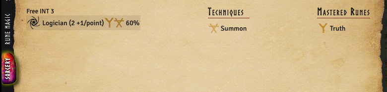

:::danger

This is still alpha level. The design of how sorcery is made **will** change. Any Sorcery spells you
make might not be possible to migrate to the future sorcery implementation.

:::

The Sorcery tab will appear when the actor has a technique rune or a mastered rune. Sorcery spells
are currently modelled as skills with runes linked to them. Creating a skill and attaching a rune
will hide that skill from the skill tab and show it here on the sorcery tab instead.

