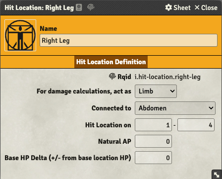

The wiki module contains compendiums with hit locations for most body types including humanoids (see
folder `Wiki RuneQuest Glorantha / Hit Locations`). If you drag a hit location to an actor it will
end up in the [Combat Tab](/rqg-system/character-sheet/combat).

The parts of a hit location are: 

### Rqid

This is required for identifying the type of this hit location, so that for example
[armor](/rqg-system/items/armor) can be made to cover it. Editing the Rqid can be done by clicking
the <LightInvertSvg src="/img/rqid.svg" width="18" /> icon in the window title bar. For more info
see the section about [Rqid](/rqg-system/api/rqid).

### For damage calculations, act as

When a hitlocation gets damage it will react differently depending on what is selected here.

There are four possible values (`Limb`, `Head`, `Chest` & `Abdomen`). And if `Limb` is chosen a
"Connected To" field is shown. This is to be able to model that an Abdomen that gets a severe hit
should make the limbs (legs) useless and the other special handling described in the section "Damage
Equal to or More Than the Location’s Hit Points" on page 147-148 in the core rulebook.

### Connected to

This is only shown for `Limb` hitlocations, see above.

### Hit Location on

This is the range on the hitlocation D20 roll that this hit location occupies. It is used when
determining what hitlocation should get damage.

### Natural AP

The armor points added here will reduce damage taken when damage is applied. The total AP of the
hitlocation will be this number plus the AP of any equipped [armor](/rqg-system/items/armor) item
that affects this hit location.

### Base HP Delta (+/- from base location HP)

The "base location HP" is calculated from the total actor HP, and since different hit locations have
different HP the "delta" is used to model how many HP this hit location should have. This value
needs to be adjusted for different creature hit locations, but in the wiki there are premade sets of
hit locations for different creatures.

For special cases that do not follow the general rule, like Gorps that have a single hit location
with HP equal to total HP, this field needs to be adjusted on the individual Gorp since the total HP
can differ between individuals.
