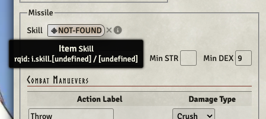
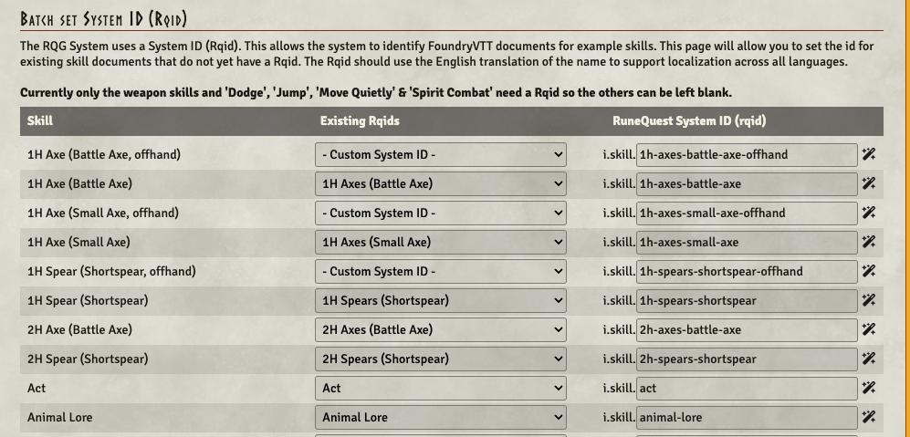
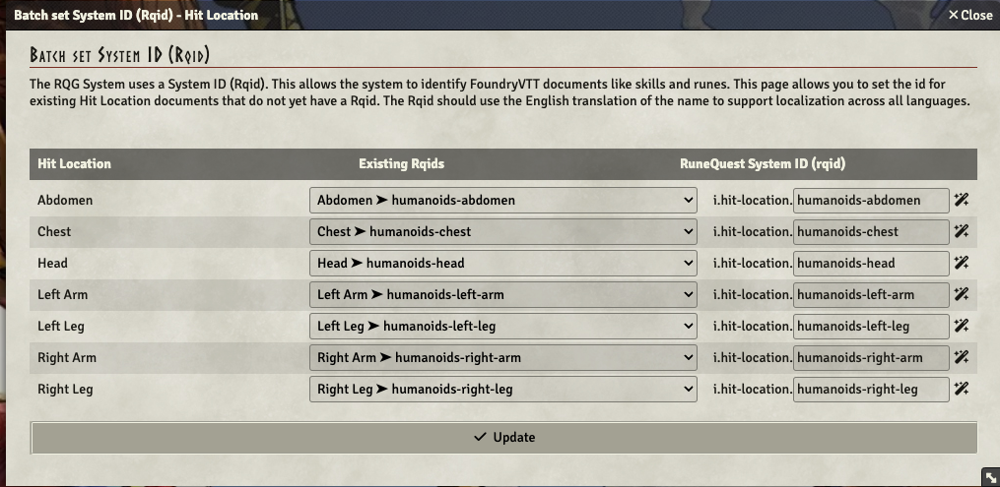
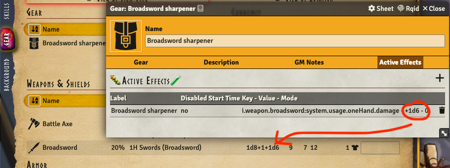
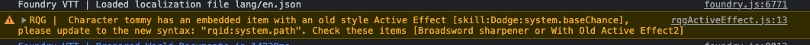
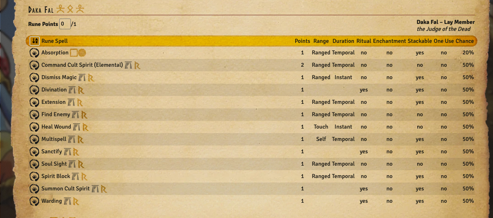
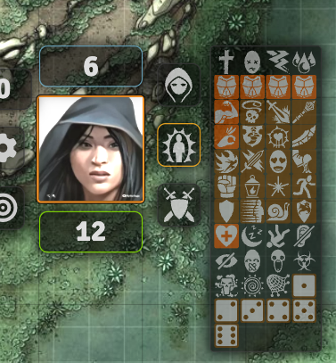
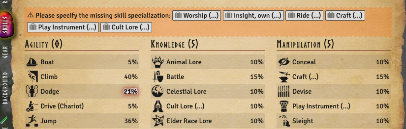

:::warning

Please note that if you have items / actors in compendiums, the migration won't work for them. That
will be fixed in [version 2.2.1](/release-notes/rqg-v2.2.1)

:::

This release might be a bit disruptive to already existing worlds since it changes the model of how
things are stored. Sorry for this wall of text but please read it before upgrading. And as always -
really do take a backup before you start! The full changelog can be found here
[CHANGELOG.md](https://github.com/sun-dragon-cult/fvtt-system-rqg/blob/main/CHANGELOG.md)

## Weapon's skills link _[Breaking!]_ [Issue #290](https://github.com/sun-dragon-cult/fvtt-system-rqg/issues/290)

Previously the link from weapon items to the skills that's needed to use them used a Foundry uuid to
point to a skill when the weapon item was not embedded and a item id to point to the skill item on
the same actor when then weapon item was embedded on an actor. This meant that if the weapon skill
in your world was deleted, then all weapon pointing to that skill would be broken. Now the skill
item is referenced with a rqid instead, which means that as long as you have at least one skill item
in your world or compendium with the correct rqid, the weapon item will find it. Hopefully this will
make the setup more resilient to changes in your worlds.

The Migration will try to find the skill previously linked and use the rqid on that skill to update
to the new way of linking skills, if it fails (because it can't find a skill with an rqid on it) it
will save the previous values and show "NOT FOUND" when the weapon use tab is shown, and hovering
will tell you the content of the previous links. In this screenshot the weapon was broken even
before the migration since both links were "undefined".

## Rqid Batch Editor steps

Starting to use Rqids for linking weapon skills is a big change and to migrate your worlds I've
incorporated a "Batch Rqid Editor" that is run before the actual migration scrips in order to set
Rqids on the items that needs it (similar to the CoC one if you've seen that one). It will go
through all items in your world and for each item that is missing an rqid it will display a row for
each distinct name (for example Jump) to let you set the rqid for all items with that name.
Currently it will show forms to set rqids for skill, rune magic & hit location items one after the
other. If it finds an exact match for the name of an item with an existing item that already has a
set rqid, then it will autofill that rqid in the form. The "Existing Rqids" dropdown lists all rqids
that exist in the system.

There is a "magic wand" icon to the right of the rqid input field that will take the name of the
item and convert that into a rqid. That can speed up the entering of data a lot, but take care to
try and use the already existing rqids where possible. The rqid should be in english even if you
have translated the system.

**⚠ One word of caution** - on my machine the form makes Chrome crash on larger worlds, and after a
lot of debugging I came to the conclusion that it was a Chrome extension that went haywire when it
saw this form with all those input fields. It's not so fun to come half way into filling this form
only to have everything disappear, so if you want to be on the safe side I would recommend doing the
migration in an incognito window without any extensions.

### ① Skills

The important ones to set Rqid on are the weapon skills and Dodge, Jump, Move Quietly & Spirit
Combat. The others can be left blank. When it comes to weapon skills there has been a lot of
variation historically what they have been called. Even though it will currently work whatever rqid
you set, I recommend to try and follow this standard for the rqid:

**Melee-weapon skills** usually are called something like `1H Daggers (Dagger)` note plural on the
category `Daggers` which translates to a rqid of `i.skill.1h-daggers-dagger`. Most of you probably
do not have offhand skills, but if you do, the rqid should be the same as the primary hand skill
with a `-offhand` suffix, for example `1h-daggers-dagger-offhand`. There are exceptions like
Quarterstaff that only is a category with no specialisation.

**Missile-weapon skills** follow the same pattern of category (specialisation), `Javelins (Javelin)`
or as rqid `i.skill.javelins.javelin`.

**Natural weapon skills** partly follow the same pattern for fist type weapons `Fists (Fist)`, but
there are also one of a kind types like `Grapple` etc.

### ② Rune Magic Spells

The system only cares about the common rune magic spells (Command Cult Spirit, Divination, Sanctify,
Summon Cult Spirit, Dismiss Magic, Extension, Multispell, Find Enemy, Heal Wound, Soul Sight, Spirit
Block, and Warding). It is used to mark these spells in the rune magic spell list on the actor sheet
(see screenshot further down )

### ③ Hit Locations

The Hit location needs Rqids to make the token hud effects work as they should (the protection
effect will search for humanoid bodyparts on the actor). Please set Rqids on the human hitlocations
"Head", "Left Arm", "Right Arm", "Chest", "Abdomen", "Left Leg" & "Right Leg" to the "humanoids"
version of rqids. You might see more rows depending on what creatures you have in your world, but
you can ignore the other hitlocations and leave them unset.

## New Syntax for custom active effects _[Breaking!]_ [Issue #442](https://github.com/sun-dragon-cult/fvtt-system-rqg/issues/442)

The syntax for custom Active Effects that affect items have changed. This is a breaking change and
will need manual fixing when encountered. The syntax for custom Active Effects previously was
`<item type>`:`<item name>`:`<affected path>` (for example skill:Dodge:system.baseChance). This is
now changed to `<rqid>`:`<affected path>` (for example i.skill.dodge:system.baseChance). This makes
the AE work in any language as well as simplifying the logic when embedding an item with an AE on an
actor. The rqid for an item can be found by opening the item sheet and clicking "Rqid" in the sheet
window header. The custom AE now also works on string values (previously it only worked on numbers).
For example you could make an effect that increases weapon damage by 1d6 by setting the "Attribute
Key" to i.weapon.broadsword:system.usage.oneHand.damage and the "Effect Value" to +1d6.

When you load your world you will get warning logs in the browser console (F12) looking something
like this if you have active effects using the old syntax.

Foundry does not let you edit AE on embedded items, so to fix an actor with a broken AE you need to
drag the item to the sidebar, delete the item from the actor, edit the AE on the item and then drag
it back to the actor.

Please note that I still consider the custom Active Effects as experimental (only a little less so
after this change).

## Sub cult refactoring _[Breaking!]_ [Issue #343](https://github.com/sun-dragon-cult/fvtt-system-rqg/issues/343)

The previous cult item could not model Orlanth's different subcults and still have one rune pool for
all of them. Now there is a concept of "deity" and "sub cults". Currently this is mostly important
for Orlanth, so if you already have a cult item with the deity Orlanth, when you drag another
subcult of orlanth to the actor they will get merged so that they share the same pool of rune
points. You can also edit the subcults of a cult item in "Cult" tab on the cult item sheet.

**⚠ Please note that if you had entered text in the previous field "Subcults" that is now gone.**
So before upgrading it could be wise to look at that field for any actors where it might be
important (read PC actors) and note what subcults they should have so you can manually add them
after the upgrade!

## add common rune magic when embedding a cult [Issue #153](https://github.com/sun-dragon-cult/fvtt-system-rqg/issues/153)

The cults supplied with the system now has a list of common rune magic spells that you get when
joining the cult (there is a field in the cult item sheet where they are listed). When dragging a
cult to an actor the actor will get all of those added. Most cults have the same set, but there are
exceptions (like Eurmal that has fewer).

Note that existing cults items will not get retrofitted with the common runemagic spells
automatically. The common runemagic spells will be marked on the actor sheet with a cult symbol as
long as they got the correct Rqid in the pre-migration Rqid form.

## Token HUD Effects [Issue #54](https://github.com/sun-dragon-cult/fvtt-system-rqg/issues/54)

The token effects have been updated to match some magic spells, like protection (1 - 4), strength,
Befuddle, Bladesharp, Bludgeon, Coordination, Counter magic, Demoralize, Dullblade, Fanatacism,
Fireblade, Glamour, Glue, Ironhand, Lantern, Light, Mobility, Parry, Shimmer, Slow, Spirit screen,
Vigour, as well as some of the previously ones like Asleep, Prone etc. In addition there are 6
general purpose effects. If you install the module
[Times Up](https://foundryvtt.com/packages/times-up), the effects with a background all disappear
after 10 melee rounds, and the ones with a brighter orange background actually affect the actor as
well (using active effects).

## ActorSheet wounded effects

The actor sheet now makes wounds more immersive, starting with a red tint if the actor is wounded
going through blurring and eventually greyscale if the actor is shocked, unconscious or dead.

## Skills without specialisation warning on Actor Sheet

Previously you would get a dialog forcing you to specify the specialization of a skill that had an
unspecified specialization (...) when you dragged it to an actor. Now the skill is embedded - but
you get a warning on the skill-tab that you should complete the skill by entering what the skill
specialization is.

