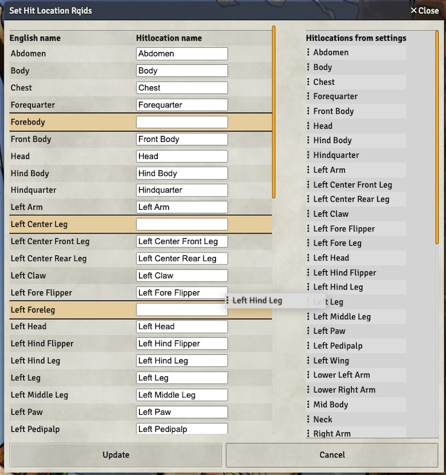

## Fixed bugs:

- add missing scorpion man hitlocation
  items, [#575](https://github.com/sun-dragon-cult/fvtt-system-rqg/issues/575)
- migration is run for new
  worlds, [#573](https://github.com/sun-dragon-cult/fvtt-system-rqg/issues/573)
- replace the broken hitlocation rqid setter form with a macro,
  [#576](https://github.com/sun-dragon-cult/fvtt-system-rqg/issues/576)
- update compendium hit-location rqids to new standard form, part of
  [#576](https://github.com/sun-dragon-cult/fvtt-system-rqg/issues/576)
- skillSheet & HitLocationSheet is missing
  values, [#572](https://github.com/sun-dragon-cult/fvtt-system-rqg/issues/572)
- wrong rqid on i.skill.fists-fist in compendium,
  [#574](https://github.com/sun-dragon-cult/fvtt-system-rqg/issues/574)
- show a rqid form for rune items,
  [#577](https://github.com/sun-dragon-cult/fvtt-system-rqg/issues/577)

## Set Hit Location Rqids Macro

There has been a design change in how the rqids for hit locations should be constructed. Now the
system default syntax is for example `i.hit-location.left-leg` and there is a macro in the
compendium "Rqid Macros" called "Set Hit Location Rqids" that can set the correct rqid on all
hit-locations (even on those that already has a rqid set).

This syntax is expected by the token effect for protection, so to make that work this macro needs to
be run, and at least the humanoid hitlocations needs to be updated.

This macro will list RQG hit location names and let you match them to the location names from the
system settings by drag-n-drop. Yellow background means that the name does not exist as a setting.
That might be fine if you do not have any creatures that need that hit location. It could also be
because you have translated the hit location to another language so that they don't match the
English names.

Drag the names from the right setting table to the corresponding hit location. If you are missing a
hit locations to drag from, just add them to the system hit location setting, and rerun this macro.

When "Update" is clicked, all hit location items in compendiums, world and scenes will get the
standard Rqid for that hit location.
