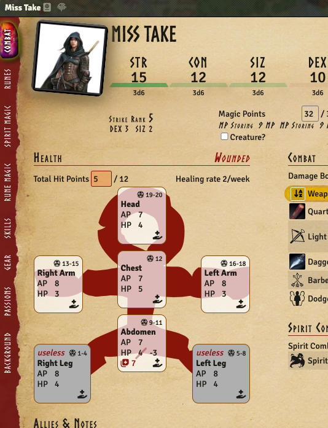
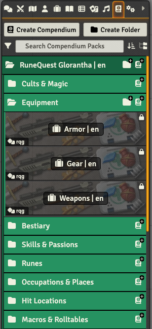
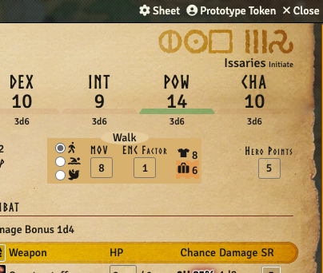
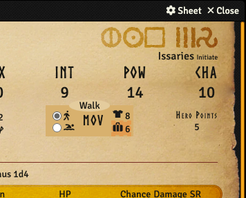
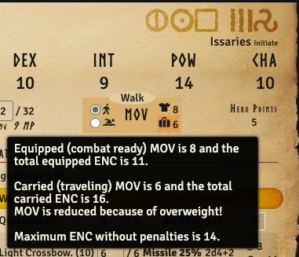
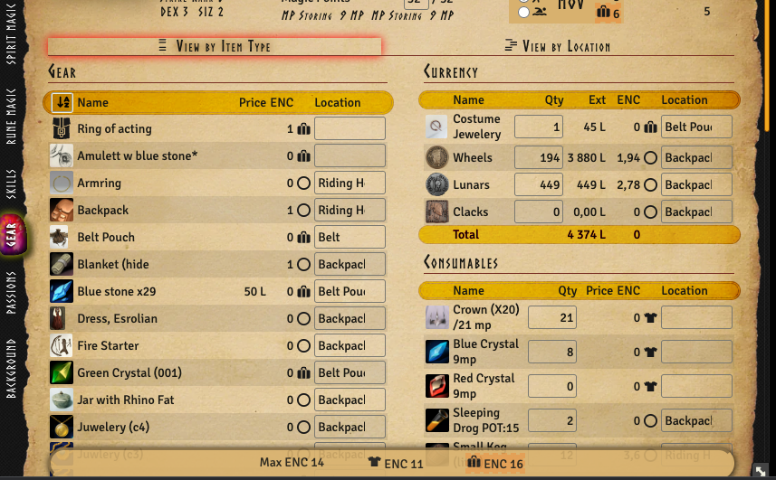
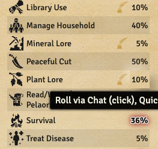
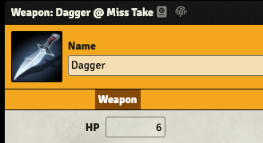
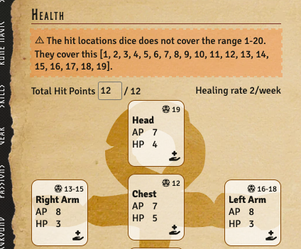
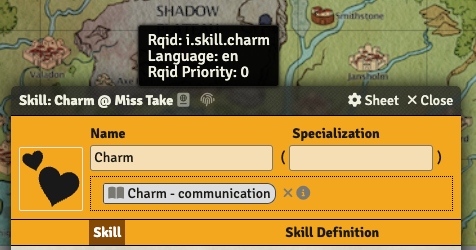

:::warning

This release drops support for Foundry 10 and introduces support for Foundry 11, so you need to
update Foundry to v11 before you can update this system to v3.0.0

:::

## New hit location view for humanoids and improved wounded indications

<GithubIssue issue="290" repo="fvtt-system-rqg" />

For actors with humanoid hitlocations the display is now more graphical. For this to work the
hitlocations need correct rqids, and that can be fixed with the supplied macro
`RuneQuest Glorantha | en`/`Macros & Rolltables`/`Rqid Macros` "Set Hit Location Rqids", that was
added in the last release.

## System compendium packs are now organized into folders

<GithubIssue issue="578" repo="fvtt-system-rqg" />

The handling of compendiums in Foundry 11 is much improved and this release takes advantage of the
new abilities by organizing the supplied system compendium packs into folders.

## Migrate Active Effects to foundry 11

<GithubIssue issue="594" repo="fvtt-system-rqg" />
<GithubIssue issue="602" repo="fvtt-system-rqg" />

Active Effects have changed in Foundry 11 and RQG now follows the new standard of not copying the
active effects from the items to the actor. Instead they remain on the items, and it is also
possible to edit acive effects even on embedded items. The "hidden" AE debug tab that shows active
effects that affect an actor has been updated to take this into consideration. Also the item sheets
no longer hide the active effect tab on embedded items. Note: To see the active effect tab run
`CONFIG.RQG.debug.showActorActiveEffectsTab=true` in the f12 browser console.

## BUG: Rune magic should not be accessible for cult laymembers

<GithubIssue issue="593" repo="fvtt-system-rqg" />

If you are not initiated into a cult you should not have access to the cults common rune magic. If
you only have laymember status in a cult the rune magic table is now hidden.

## Improve UX of MOV and relocate the ENC display to the gear tab

<GithubIssue issue="516" repo="fvtt-system-rqg" />

The MOV / ENC display in the actor sheet header has been too complicated. This tries to simplify it
by concentrating on shoving MOV only there. The max / equipped % carried ENC is shown on the gear
tab instead.

_GM view_ 

_Player view_ 

_MOV tooltip_ 

_ENC display_ 

## Make it easier to see if a skill can get experience or not

<GithubIssue issue="476" repo="fvtt-system-rqg" />

On the skill tab there is now a "pen" icon on the skills that can not be improved by experience, but
has to be studied to improve. This should make it more obvious why you don't get an "experience"
glow on some skills.

## Show parent document name on itemSheets title

To make it easier to know what item sheet you are looking at the actor name is now shown in the
title.

## Show a warning if the hit locations don't add up

<GithubIssue issue="499" repo="fvtt-system-rqg" />

If an actor has a set of hit locations that do not cover the full range of the d20 hit location die,
or if there are hit locations that overlap there will now be a warning displayed to make it more
obvious that the actor is not correctly set up.

## Add tooltip to rqid window button

<GithubIssue issue="455" repo="fvtt-system-rqg" />

The titlebar rqid icon is moved to the left side, next to the Foundry id icon. Also it is no longer
necessary to open the rqid window to see what rqid the document has, since that information is now
shown as a tooltip.

## Various minor tweaks for Foundry v11

- fix: icon color in compendiums is wrong in v11 <GithubIssue issue="585" repo="fvtt-system-rqg" />
- fix: foundry v11 warns about Item translation <GithubIssue issue="583" repo="fvtt-system-rqg" />
- feat: use Foundry font definition for Norse font
  <GithubIssue issue="595" repo="fvtt-system-rqg" />
