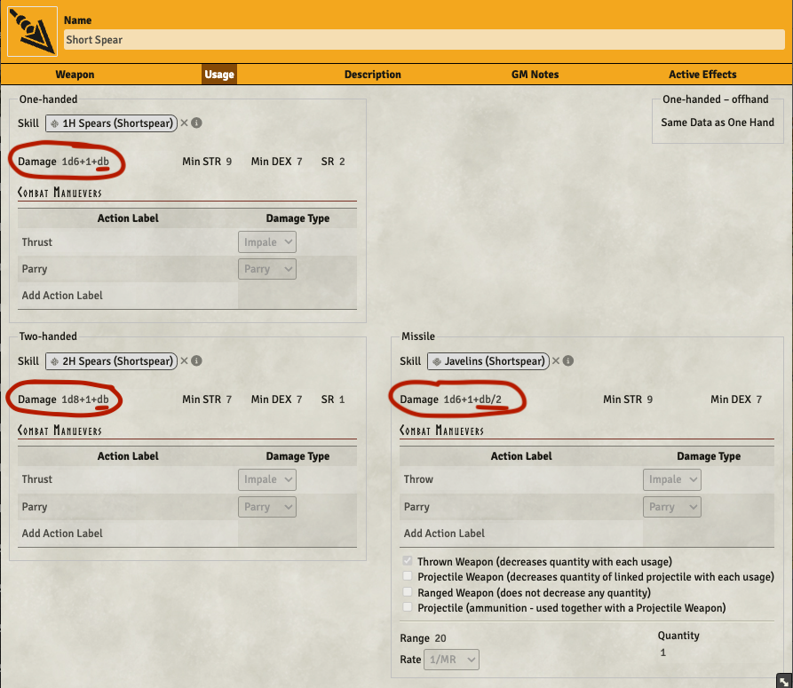
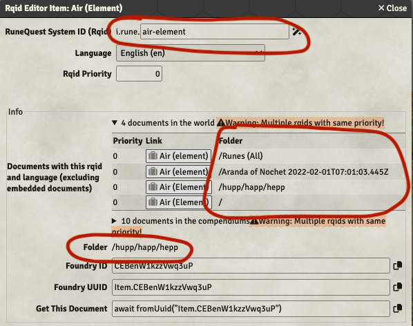

:::warning

Make sure to update the wiki module to at least version 1.0.0 since this system version includes
changes to document types that needs to be reflected in these documents. Please look at the
[Installing](/rqg-system/getting-started) page for details about the wiki module.

:::

## Make damage bonus part of weapon damage string

<GithubIssue issue="106" repo="fvtt-system-rqg" />

In previous versions the system tried to figure out if full, half, or no damage bonus should be
added to the weapon damage by looking at if it's a melee, thrown or missile weapon. This worked for
the majority of weapons, but could not capture exceptions like sling that is a projectile weapon,
but anyway should get half damage bonus.

Starting with this version you need to add `+db` or `+db/2` to the damage string of the weapon if
you want it to include a damage bonus. The damage listed in the Weapons & Equipment books are
expressed in the same way (except they write halv damage bonus like `+½db`).

There is a migration included that should update all existing damage strings.

## Make runes translatable by using rqid for linking

<GithubIssue issue="270" repo="fvtt-system-rqg" />

Previous versions used the name of rune items for linking to them, with this change the rqid of the
runes are used instead. This should make it possible to translate the name of the runes.

The links that were changed was; opposing & minor runes links in the rune item, cult item runes,
rune magic item runes, and skill runes (used for sorcery spells until a dedicated sorcery spell item
type exists). With this change the system setting for the name of the magic rune was removed and the
rqid of the magic rune is now a CONFIG instead (set to `i.rune.magic-condition` by default).

There are migrations for all the item changes needed for this.

## Improvements to the rqid editor

<GithubIssue issue="457" repo="fvtt-system-rqg" />
<GithubIssue issue="642" repo="fvtt-system-rqg" />

The Rqid editor field for the id now autofills the part of the id that fully depends on the document
type. It also handles setting language and priority better when creating a new rqid. You will get
default values for that when you set a rqid.

The info display, as well as the list of other items with the same rqid now has an improved display
of what folder the document is located in.

## Hide Opposing / Minor rune settings depending on runeType on Rune Item Sheet

<GithubIssue issue="269" repo="fvtt-system-rqg" />

The settings for opposing and minor runes in the rune item sheet are now only shown when they are
relevant according to the type of the rune.

## Bug fixes

- Name of special damage in chat damage roll is impale even for slash damage
  <GithubIssue issue="629" repo="fvtt-system-rqg" />
- Actor without POW / MP is shown as unconscious and also show MP input field
  <GithubIssue issue="631" repo="fvtt-system-rqg" />
- Null exception if hit location lacks rqid flag "id" when dragged to actorSheet
- Combat panel SR button is not right aligned for natural weapons
