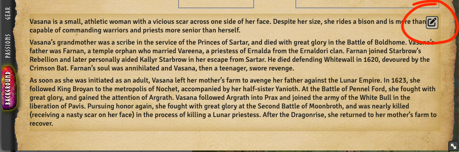

import EditModeSvg from "./edit-mode.svg";
import PlayModeSvg from "./play-mode.svg";

This released focuses on making the editability for players.

## Edit mode on actor sheets

<GithubIssue issue="639" repo="fvtt-system-rqg" />
<GithubIssue issue="663" repo="fvtt-system-rqg" />
<GithubIssue issue="667" repo="fvtt-system-rqg" />

There are now two modes on the actor sheet, <ThemeInvert><EditModeSvg /></ThemeInvert> **Edit Mode**
and <ThemeInvert><PlayModeSvg /></ThemeInvert> **Play Mode**. You can switch between the modes by
clicking on those icons in the actor sheet title bar.

:::note

To be able to switch between the edit & play mode you need to be a trusted player or higher. Even
normal players can edit their values if their GM switches the mode for them, but they can not change
mode themselves.

:::

In edit mode it is possible to edit characteristics, rune, skill & passion values. The screenshot of
the skills tab, shows the gained chance input field. The percent chance shown to the right is the
"normal" chance that includes both base chance and skill category bonus, as well as the gained
chance.

To make it easy to see what mode the actor is in, a lot of accent colors are changed to green when
it is in edit mode.

Play mode hides some things for the GM to make the actor sheet less cluttered. An example of this is
the `Creature?` toggle that only is available in edit mode.

A new actor starts in edit mode, this means that after this upgrade all actors will be in edit mode.
You can easily fix that by clicking on the edit mode toggle, or you can run a script that will be
supplied separately.

## Add gear items directly from actorSheet

<GithubIssue issue="671" repo="fvtt-system-rqg" />

It is now possible for players (and GMs) to add new gear (gear, currency & consumables) themselves
by clicking on a + icon.

## Loosen duplicate embedded item name check

<GithubIssue issue="672" repo="fvtt-system-rqg" />

As a followup to being able to create new gear, it is now also possible to have duplicates.
Previously you could only have one gear, armor or weapon named the same, but now you can have as
many as you like.

## Drag a weapon to a pack animal without adding the weapon skills

<GithubIssue issue="450" repo="fvtt-system-rqg" />

If you drag a weapon to an actor the skills linked to that weapon will also be added so that the
actor can use the weapon. This is good in most cases, but if you drag a spear to a horse it doesn't
make sense that the horse gets the skill to fight with that spear. This issue is solved by checking
if the actor you drag the weapon to has arms (specifically a hitlocation with the rqid
`i.hit-location.right-arm`) and if it doesn't it won't add the skills.

## Background tab biography field should be player editable

<GithubIssue issue="670" repo="fvtt-system-rqg" />

Only the GM could edit the biography text field on the background tab of the actor sheet. Now
players can do that too.

## Add hit location and rune dropdowns into RqidLink areas

<GithubIssue issue="656" repo="fvtt-system-rqg" />

In all places where you can set a link to a rune or hit-location there now is a dropdown that will
add a link. You can still drag-n-drop to the area but it is hopefully an easier way to adding these.

The lists are populated by looking in compendiums for rqids of rune and hit locations, so if you
would like to add more runes / hit locations, you would need to create a compendium and assign a new
rqid to them.

## Make Hero Points an opt-in setting

<GithubIssue issue="661" repo="fvtt-system-rqg" />

Hero points are not part of the standard rules but was still shown on the character sheet. You can
now decide if you want them or not with a setting.

:::warning

If you use the hero points you need to enable them in the settings after upgrading to this release.

:::

## Make the characteristics ratings an opt-in setting

Each user (GM or player) can now decide if they want to see the rating of the characteristics value
as a red / green bar under the value. The setting is per user, but realistically it's mostly for GMs
to get a quick evaluation of NPCs.

## Other Bug Fixes & Improvements

- Rqid editor "Get Document Like This" is not filled in properly
  <GithubIssue issue="665" repo="fvtt-system-rqg" />
- Priests don't get the 20% bonus to their POW gain roll
  <GithubIssue issue="649" repo="fvtt-system-rqg" />
- Show an explanation in the Rune Magic tab why nothing is shown as lay member
  <GithubIssue issue="668" repo="fvtt-system-rqg" />
