This long overdue release completely rewrites the handling of rolls. Under the hood it introduces
multiple new Foundry rolls:

- AbilityRoll
- CharacteristicRoll
- DamageRoll
- HitLocationRoll
- RuneMagicRoll
- SpiritMagicRoll

In addition, it has a completely new take on the combat flow with attack / defence rolls.

## Rewrite of the roll system and combat flow

<GithubIssue issue="639" repo="fvtt-system-rqg" />
<GithubIssue issue="116" repo="fvtt-system-rqg" />
<GithubIssue issue="138" repo="fvtt-system-rqg" />
<GithubIssue issue="447" repo="fvtt-system-rqg" />
<GithubIssue issue="695" repo="fvtt-system-rqg" />
<GithubIssue issue="115" repo="fvtt-system-rqg" />
<GithubIssue issue="613" repo="fvtt-system-rqg" />
<GithubIssue issue="526" repo="fvtt-system-rqg" />
<GithubIssue issue="705" repo="fvtt-system-rqg" />
<GithubIssue issue="737" repo="fvtt-system-rqg" />

When you click on a rune, skill, spell, passion, characteristic or a weapon, it will now show a roll
dialog, instead of displaying a chatmessage. The dialogs are built with Foundry ApplicationV2, so
they will adjust to your light/dark mode Foundry setting, see below.

The visual representation of these rolls in the chat are also completely rewritten, and tries to be
more easily scannable for the eye by using visual clues for different success levels, bold text for
what is rolled, and by adding toned down background images according to what is rolled. Another
design intent is to keep the chat messages as small as possible to not clutter the chat. In line
with that is the expand roll feature, which will show the modifiers used in the roll if the roll is
clicked.

---

### Ability Check

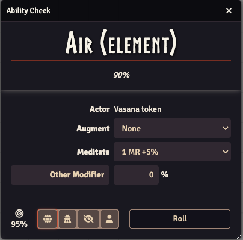 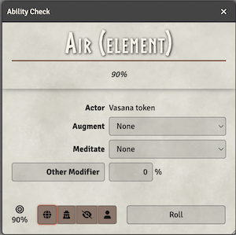

At the top it will display what ability you are rolling for (rune, skill, passion or reputation),
and the "native" percent chance.

In the middle you can see

- **Actor** - the token actor that is doing the ability check.
- **Augment** - a dropdown to choose any augments in effect.
- **Meditate** - a dropdown to choose any meditations in effect.
- **Other Modifier** - a text field to enter any other modifiers. This is not a dropdown, so you can
  enter anything you want, both in the describing text field, and in the numeric percentage
  modification field. It will be shown in the expanded roll in the chat message.

At the bottom you can see the target percentage that you will roll against. You can also select the
roll mode (Public Roll, GM Private Roll, GM Roll or Self Roll). And to the right is a button to do
the roll and open a chat message to show the result.

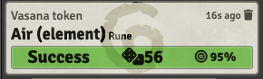 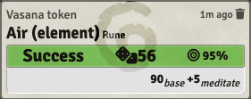

The chat message will show what was rolled, what token that did the roll, the result of the roll,
and if you click the "Success" line it will expand to show what modifiers were used.

The "Success" line will be differently styled depending on the result of the roll to make it quick
and easy to see the outcome. It shows the result (Fumble / Fail / Success / Special / Critical), the
result of the dice roll, and the target you need to roll under.

---

### Characteristic Check

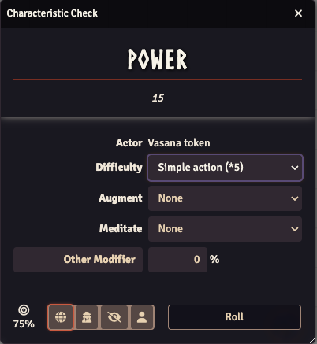

Similar to the ability check, but for characteristics. At the top it will show the characteristic
name and value.

In the middle you can see

- **Actor** - the token actor that is doing the characteristic check.
- **Difficulty** - a dropdown to choose the difficulty (multiplier) of the roll.
- **Augment** - a dropdown to choose any augments in effect.
- **Meditate** - a dropdown to choose any meditation that is done.
- **Other Modifier** - a text field to enter any other modifiers. This is not a dropdown, so you can
  enter anything you want, both in the describing text field, and in the numeric percentage
  modification field. It will be shown in the chat message.

The bottom part is the same as the ability check above. And the chat message will look like this
when the result is expanded to show any modifiers.

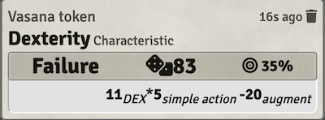

---

### Spirit Magic

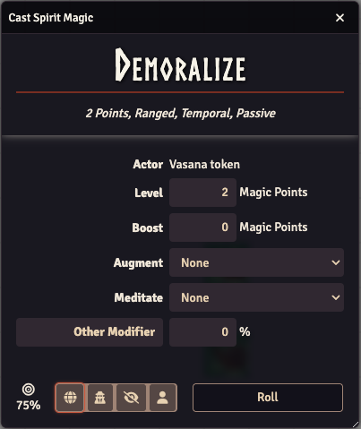

Similar to the ability check, but for casting Spirit Magic. At the top it will show the spell name
and properties.

In the middle you can see

- **Actor** - the token actor that is casting the spell.
- **Level** - how many magic points you will use to cast the spell. This value is only possible to
  edit if the spell is variable.
- **Boost** - how many magic points you will use to boost the spell to overcome any defences.
- **Augment** - a dropdown to choose any augments in effect
- **Meditate** - a dropdown to choose any meditation that is done.
- **Other Modifier** - a text field to enter any other modifiers. This is not a dropdown, so you can
  enter anything you want, both in the describing text field, and in the numeric percentage
  modification field. It will be shown in the chat message.

The bottom part is the same as the ability check above. And the chat message will look like this
when the result is expanded to show any modifiers.

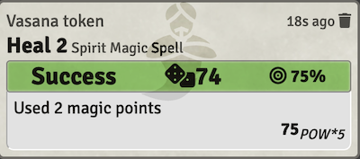

---

### Rune Magic

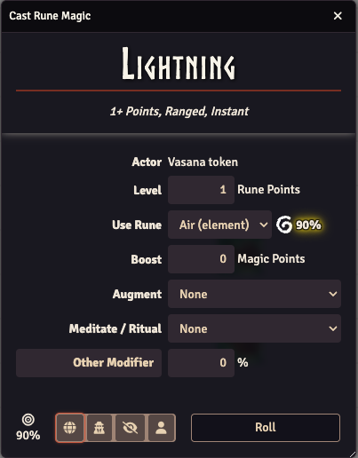

Similar to the ability check, but for casting Rune Magic. At the top it will show the spell name and
properties.

In the middle you can see

- **Actor** - the token actor that is casting the spell.
- **Level** - how many rune points you will use to cast the spell. This value is only possible to
  edit if the spell is stackable.
- **Use Rune** - a dropdown to choose which rune you will use to cast the spell. The rune image and
  percentage of the selected rune is shown to the right, and if the rune has an experience check it
  will have a glow behind it, similar to how it looks in the character sheet.
- **Boost** - how many magic points you will use to boost the spell to overcome any defences.
- **Augment** - a dropdown to choose any augments in effect
- **Meditate / Ritual** - a dropdown to choose any meditations or ritual preparations.
- **Other Modifier** - a text field to enter any other modifiers. This is not a dropdown, so you can
  enter anything you want, both in the describing text field, and in the numeric percentage
  modification field. It will be shown in the chat message.

The bottom part is the same as the ability check above. And the chat message will look like this
when the result is expanded to show any modifiers.

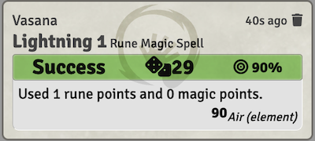

---

### Combat – Attack & Defence

The way combat works has changed. Ideally you should have a token selected that is the target of the
attack before clicking the weapon you want to attack with. It is possible to use this without
setting a target, and instead let anyone defend, but you cannot aim an attack unless you have a
target selected.

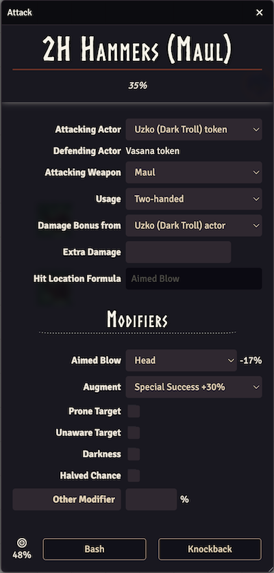

Similar to the ability check, but for attacking someone. At the top it will show the skill name, and
the "native" percent chance.

In the middle you can see

- **Attacking Actor** - the token actor that is doing the attack. If you own more than one actor
  (token) you can change the actor via this dropdown.
- **Defending Actor** - This will display the name of the targeted token, or say "No target
  selected" if none is selected. You can only have one token targeted, if you have selected more
  than one you will get a notification about that, and one of them (whatever happens to be the
  "first") will be used as the target.
- **Attacking Weapon** - the weapon that is used to attack. The dropdown will contain the weapons
  the attacking actor has equipped.
- **Usage** - this decides how the weapon will be used, for example one-handed or two-handed. The
  dropdown will contain the options that are available for the selected weapon.
- **Damage Bonus From** - This can be used to get the damage bonus from an animal you are riding on
  if you are doing a charge. It is preselected to the attacking actor, but can be changed to any
  other token on the current scene that you are the owner of that is not a humanoid.
- **Extra Damage** - You can add either a number or a roll formula here. It can for example be used
  to get the extra damage from a bladesharp spell to be part of the damage calculations.
- **Hit Location Formula** - The dropdown contains 3 options; the normal `1d20`, `1d10` & `1d10+10`
  to allow attacking from below or above. If "Aimed Blow" (below) is selected, this will be disabled
  since you will hit the hit location chosen there.

**Below the "Modifiers" heading there are different modifiers you can apply**

- **Aimed Blow** - If you have a target selected, you can choose to aim the blow to hit a specific
  hit location. The dropdown will show the hit locations of the target. Selecting a hit location
  here will halve the base percentage chance.
- **Augment** - a dropdown to choose any augments in effect
- **Prone Target** - checking this checkbox will add a +40% modifier to the target chance.
- **Unaware Target** - checking this checkbox will add a +40% modifier to the target chance.
- **Darkness** - checking this checkbox will add a -75% modifier to the target chance.
- **Halved Chance** - checking this checkbox will halve the base percentage chance.
- **Other Modifier** - a text field to enter any other modifiers. This is not a dropdown, so you can
  enter anything you want, both in the describing text field, and in the numeric percentage
  modification field. It will be shown in the chat message.

At the bottom you can see the target percentage that you will roll against, as well as buttons with
the attack modes you can do with the selected weapon. Clicking one of these buttons will give this
chat message:

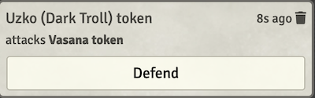

If there is a target selected, only users that own that target will see the defend button. Clicking
it will open the defence dialog:

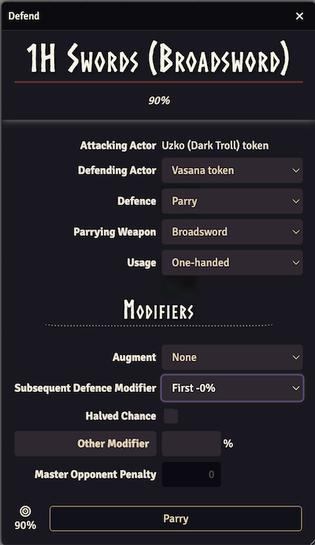

This is similar to the attack dialog, but for defending an attack against you. At the top it will
show the skill name, and the "native" percent chance.

In the middle you can see

- **Attacking Actor** - the token actor that is doing the attack.
- **Defending Actor** - This will display the name of the targeted token, or present a dropdown of
  tokens you own that are part of the current scene. If you do not have a token that can defend you
  will instead see a notification about that instead of this dialog.
- **Defence** - Depending on what the Defending Actor can do you will see a dropdown with "Parry",
  "Dodge" and "Ignore". Changing this will affect the rest of the dialog, hiding or showing
  different parts.

- **Parrying Weapon** - the weapon that is used to parry with. The dropdown will contain the weapons
  the attacking actor has equipped that can be used for parry.
- **Usage** - this decides how the weapon will be used, for example one-handed or two-handed. The
  dropdown will contain the options that are available for the selected weapon.

**Below the "Modifiers" heading there are different modifiers you can apply**

- **Augment** - a dropdown to choose any augments in effect
- **Subsequent Defence Modifier** - the dropdown lets you choose the penalty for defending against
  multiple attacks.
- **Halved Chance** - checking this checkbox will halve the base percentage chance.
- **Other Modifier** - a text field to enter any other modifiers. This is not a dropdown, so you can
  enter anything you want, both in the describing text field, and in the numeric percentage
  modification field. It will be shown in the chat message.
- **Master Opponent Penalty** - if the attacker has a chance above 100% you can get a penalty to the
  defence here. If you have over 100% on the defence, the attacking roll will get a penalty.

At the bottom you can see the target percentage that you will roll against, as well as a button to
do the selected defence.

Pressing that button will roll the attack and defence rolls, and update the previous chat message
with info about the rolls, and the outcome from the attack/parry, or the attack/dodge table like
this:

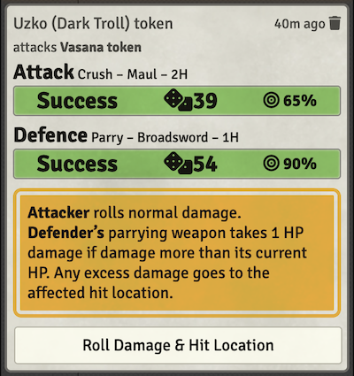

The rolls can be expanded to reveal the modifiers applied. Depending on the outcome you will see
different things, but in this example clicking on the button "Roll Damage & Hit Location" will do
these rolls, and update the chatmessage with the outcome of those as well:

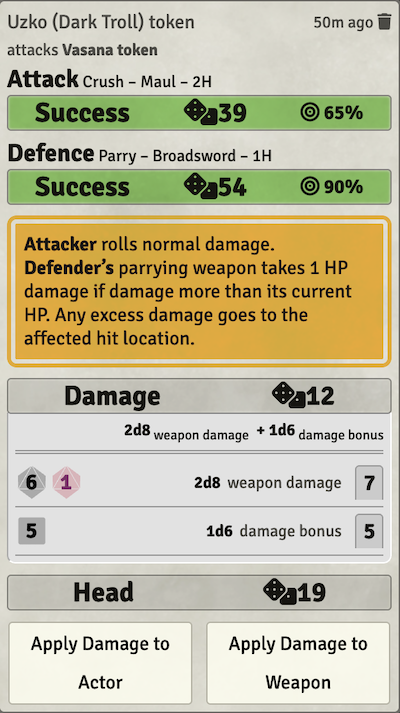

Again exactly what will be show will depend on the outcome, but in this example the damage roll was
clicked to show the details of the damage roll, and you can apply the damage to the parrying weapon,
and also apply the damage that went through the weapon to the defenders head.

Clicking "Apply Damage to Weapon" will reduce the HP of the weapon (in this case the defending
weapon).

Clicking "Apply Damage to Actor" will apply the rolled damage to head, reducing AP unless the blow
should ignore armor. If the damage is stopped by the armor a ui notification will inform about that
nothing went through.

The buttons will disappear when clicked, leaving a summary of the attack in the chat.

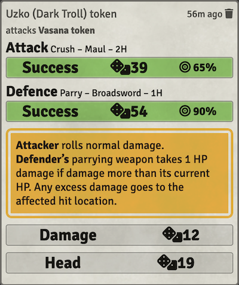

Exporting the chat will also give a summary of what happened:

```
[5/14/2025, 1:13:16 PM] Uzko (Dark Troll) token
attacks Vasana token
AttackRoll: 39 / 65 = Success
DefenceRoll: 54 / 90 = Success
Attacker rolls normal damage.Defender’s parrying weapon takes 1 HP damage if damage more than its current HP. Any excess damage goes to the affected hit location.
DamageRoll: 2d8[weapon damage] + 1d6[damage bonus] = 7 + 5 = 12
HitLocationRoll: 19 = 19 = Head
```
