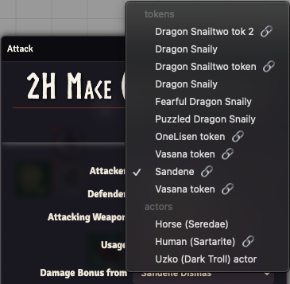
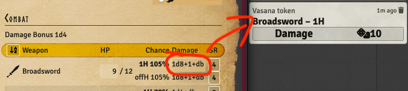

The previous release inadvertently removed the possibility to do combat without having tokens on a
scene. This release fixes that, and also adds a few new features and improvements.

## Allow actors to combat even without tokens

<GithubIssue issue="760" repo="fvtt-system-rqg" />

In version 4.0.2 you could only use tokens on a scene to do combat. This release adds both tokens
and actors to the attacker and defender dropdowns in the combat dialogs.

Since adding this feature will increase the number of items in those dropdowns there is now a new
system setting that lets you opt out of seeing actors.

An added feature is that the dropdowns will specify if the dropdown item is a token or an actor. And
if you are a GM you will also see a 🔗 icon next to the actors that are linked.

## Make it possible to roll weapon damage directly

<GithubIssue issue="759" repo="fvtt-system-rqg" />

It is now possible to roll the damage of a weapon directly from the weapon line in the combat tab.
This will be a completely manual roll without any automation. It will also be a "normal" roll so no
support for special successes or criticals. But any damage bonus will be added and rolled.

## Other Bug Fixes & Improvements

- There were some debug logs left by mistake in the previous release, this release removes those.
