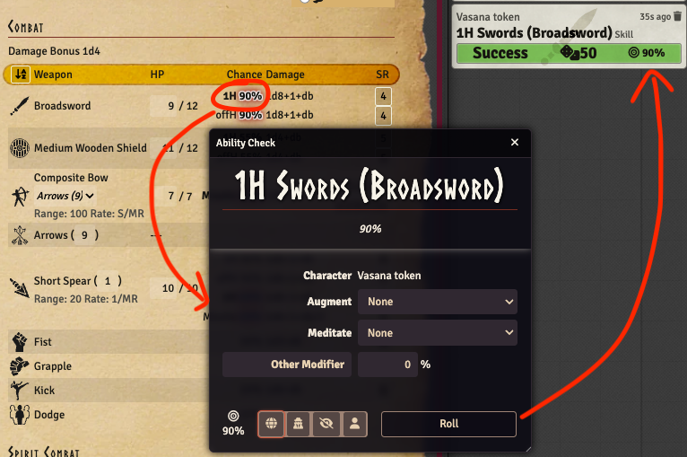

This release contains a few bug fixes and improvements, the main feature is that it is now possible
to do an ability roll directly from the combat tab weapon chance.

## Allow simple weapon skill ability check

<GithubIssue issue="768" repo="fvtt-system-rqg" />

This allows you to do a simple ability check for the weapons skill from the combat tab without
initiating a full combat flow. A single click on the percentage chance will open the ability roll
dialog for the skill row clicked. Double-clicking will roll directly to chat without any dialog in
the same way any other ability roll works.

## Other Bug Fixes & Improvements

- Slashing Damage incapacitation was incorrectly being applied to all cut(ting) attack
  <GithubIssue issue="764" repo="fvtt-system-rqg" />
