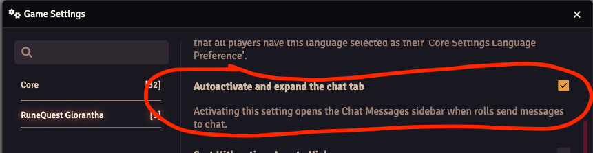

:::warning

This release drops support for Foundry 12 and introduces support for Foundry 13, so you need to
update Foundry to v13 before you can update this system to v5.0.0

:::

There are a lot of changes under the hood to follow the Foundry v13 way of doing things. The amount
of deprecation warnings are greatly reduced, but there are some still left since they require larger
rewrites that will come later. They should not impact the functionality though.

There are not a lot of new features in this release, but the styling in various places have been
updated to look more like Foundry v13.

Also in the previous versions you did not get strike rank buttons for unlinked actors, this release
will show those buttons for unlinked actors as well. See
[SR Buttons](https://sun-dragon-cult.github.io/release-notes/rqg-v3.1.0#add-sr-buttons-to-actor-sheet)
for more info about how they work.

Foundry v13 have a system where you can see the last chat even if you have the chat collapsed. This
RQG version introduces a setting so you can decide if the chat should be expanded when you roll
something. That should make the feeling more similar to how it was before.

There are now links to the Release Notes (this), Documentation and Bug Reports (Github issues) under
the settings sidebar for easy reference.

## Add copyable RQID journal link to RQID editor

<GithubIssue issue="765" repo="fvtt-system-rqg" />

A small new feature in this version is that you can now get a premade Rqid link string that you can
paste into your journals if you want a link to a "type" of document. This is not a new feature, but
before you had to type the link manually. Now you get a premade string that you can use from the
Rqid editor that you can open via the <LightInvertSvg src="/img/rqid.svg" width="18" /> icon in the
document titlebar. The styling of the dialog was also slightly improved.

After pasting that string into the journal it will look like this. You can tell if the link is a
default Foundry UUID link or a RQID link by the surrounding border. RQID links have a dashed,
rounded border where the UUID links have a thin solid border without rounding instead.

