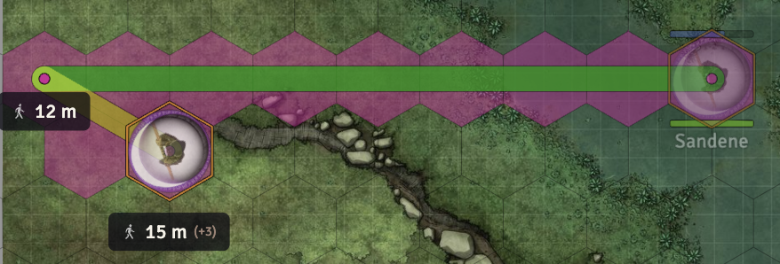
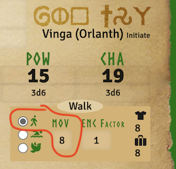
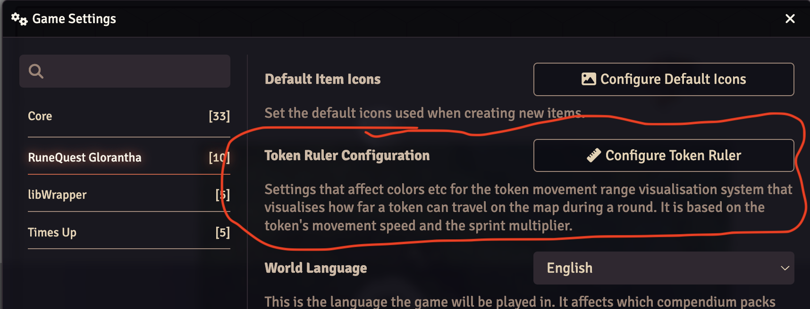
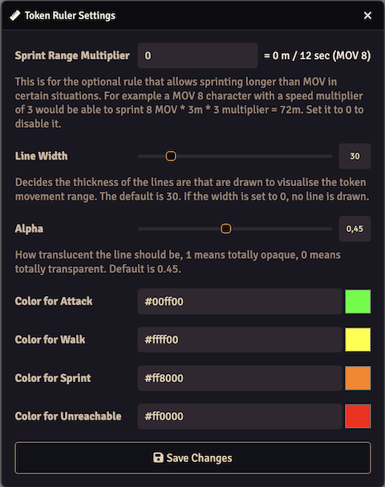
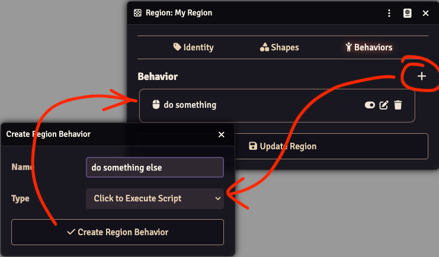
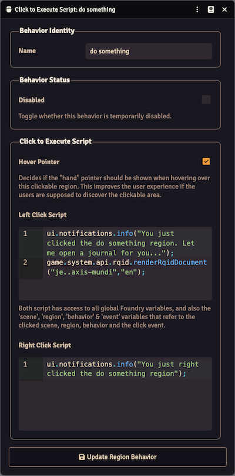
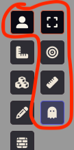

This release adds two bigger features, and fixes a really bad bug related to combat.

## System native drag-ruler module replacement

<GithubIssue issue="771" repo="fvtt-system-rqg" />

The drag-ruler module is not compatible with Foundry v13. This release introduces a system native
implementation that uses the new Foundry Token Drag Measurement API to color code token movement.

There is some intregration with the Foundry movement actions. If you change the token movement to
swim or fly, then the MOV will be updated to reflect that according to the setting on the actor
sheet.



How the drag ruler looks when dragging a token. The line is color coded according to the MOV of the
token and the settings (see below). The hexes / squares are colored by Foundry to match the user
color.



Actor sheet in edit mode where you can set the MOV for various locomotion modes. If you change the
token movement, it will use the MOV values from the actor sheet to match the selected locomotion
mode. see [Foundry 13 Haul and Drag](https://foundryvtt.com/releases/13.341#token-drag). The drag
ruler is only visible for tokens that are in combat.



You can find the settings for the drag ruler in the system settings dialog.



The settings dialog for the drag ruler. The settings are explained in the dialog. The colors are for
the different ranges.

- Attack: half MOV - you can still attack after moving this far.
- Walk: full MOV - you can walk this far but loose your attack.
- Sprint: range is decided by the sprint setting. It's off (0) by default since this is an optional,
  non standard rule.
- Unreachable: you cannot move here. Note that you will not be prevented to move, but the line will
  be red (or whatever color you set it to).

## Add a clickable region behavior

<GithubIssue issue="775" repo="fvtt-system-rqg" />

This adds the possibility to write scripts that run when you click on regions. It's done in the form
of a region behavior called "Click to Execute Script". You add one by creating a region, go to the
Behaviors tab and press +





Adding a behavior will open the settings dialog. The top part with "Behavior Identity" and "Behavior
Status" behaves in the same way as other Foundry behaviors. You can name and disable the behavior
here.

In the next section the "Hover Pointer" lets you decide if the mouse pointer should change while
hovering over the clickable region.

The two text boxes for "Left Click Script" and "Right Click Script" accepts javascript and that
javascript will be run when you left or right-click on the region.

Each region can have multiple behaviors, even multiple "Click to Execute Script" behaviors. And you
can have multiple regions that may overlap each other. If you have multiple "Click to Execute
Script" behaviors they all will run even if they overlap.

As the hint text between the script boxes says you have access to variables in the scripts in case
you want to check something about the event, behavior, region or scene. You could for example check
if the shift key was pressed while you clicked and do something else in that case.



The click is only detected while you are on the TokenLayer - in other words while you are editing
the regions it will not register the clicks, you have to have the top left tool selected.

This makes it quite powerful, but also less user-friendly since you need to know a bit of javascript
to make something happen. Here are some snippets to get started:

#### Open a journal entry using Rqid (or anything else with a Rqid like an actor or item)

```js
game.system.api.rqid.renderRqidDocument("je..axis-mundi", "en");
```

#### Open something specific using UUID

```js
// This can open anything in the world
fromUuidSync("Actor.BKBAy0w4MgvgYeKZ").sheet.render(true);

// With this syntax you can also open documents from the compendiums
(await fromUuid("Compendium.wiki-en-rqg.cults.Item.61zfpHEpM9RtE6XS")).sheet.render(true);
```

#### Run a macro via UUID (could use Rqid also)

```js
fromUuidSync("Macro.ufYFMHFOpuncTeiq").execute();
```

#### Apply 5 points of damage to the head to all targeted tokens

```js
game.user.targets.forEach((token) => token.actor.applyDamage(5, 20));
```

#### Do different things depending on modifier key presses

```js
let message = "You clicked this region";

if (event.ctrlKey) {
  message += " and held the ctrl key at the same time";
}
if (event.altKey) {
  message += " and held the alt key at the same time";
}
if (event.shiftKey) {
  message += " and held the shift key at the same time";
}

ui.notifications.info(message);
```

## Other Bug Fixes & Improvements

- CombatTracker etc needs v13 updates. Not sure how I missed this in the previous version, but it
  should now be updated to work with Foundry v13. <GithubIssue issue="777" repo="fvtt-system-rqg" />

- Calculation of Dodge and Jump skill chance in skillSheet was wrong. It did not update the base
  chance according to actor DEX correctly. <GithubIssue issue="785" repo="fvtt-system-rqg" />
