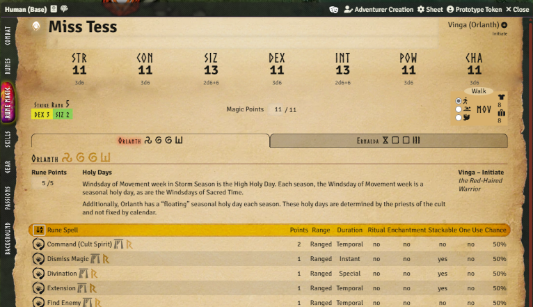

:::warning

This release contains a major refactor of basically all code. It should work better, but it's quite
possible that some new bugs have been introduced. Use this version with care!

:::

The main objective with this release is to replace the old deprecated build system with a more
modern solution as well as updating the typescript type system to a modern version.

<GithubIssue issue="823" repo="fvtt-system-rqg" />
<GithubIssue issue="124" repo="fvtt-system-rqg" />

This is not something that should be visible for you game masters and players, but some of the
changes include:

- Change build system from Snowpack to Vite resulting in a smaller package size, and also the
  ability to update nodejs to a modern version in pace with what Foundry needs. It also improves the
  developer experience by providing HMR (Hot Module Replacement) and faster build speed.
- Changed the test framework from Jest to Vitest
- Updated the typescript foundry vtt types to the latest version. This should help with finding
  subtle errors where the code is calling Foundry with deprecated or wrong methods or parameters.
- Added Stylelint to format and find errors in css files. Some minor changes to css class names have
  been made.
- Dependency updates including typescript and nodejs
- The variable name for RQG Token Ruler settings have changed, meaning you might need to reapply
  your settings for line width, alpha & colors if you have changed them.

## Multi-Cult Rune Magic Tabs

<GithubIssue issue="681" repo="fvtt-system-rqg" />
<GithubIssue issue="696" repo="fvtt-system-rqg" />

If you have more than one cult the sheet previously became very long and hard to navigate, making it
hard to find the rune magic spells you want to use.

The rune magic tab on the character sheet now displays separate tabs for each cult the character is
a member of, with cult-priority sorting to help you organize which cult's magic is most important to
your character. The order is in priority:

1. Highest ranking in the cult (priest, initiate, lay member etc)
2. Highest amount of rune points in the cult
3. Alphabetical by diety name

## Limit POW experience checks

<GithubIssue issue="786" repo="fvtt-system-rqg" />

When you roll against POW directly, the system will now show an informational message explaining
when POW experience can be gained instead of automatically checking it for a successful roll. The
experience can still be manually toggled via the context menu when appropriate.

When a successful Worship or SpiritCombat roll is made the POW experience is checked now.

The notification will not close automatically, you need to click it to make it go away.

## Bug Fixes

- Master opponent modifier was wrong when both combatants had over 100% chance.
  <GithubIssue issue="825" repo="fvtt-system-rqg" />
- Half Chance modifier does did work in Attack Dialog
  <GithubIssue issue="820" repo="fvtt-system-rqg" />
- Combat Card "Damage Bonus From" failed to Select Correct Token, but picked any token with the same
  damage bonus
  <GithubIssue issue="809" repo="fvtt-system-rqg" />
- Rune magic Special & Critical successes didn't trigger experience checks
  <GithubIssue issue="818" repo="fvtt-system-rqg" />
- Misalignment in gear tab ENC box <GithubIssue issue="802" repo="fvtt-system-rqg" />
