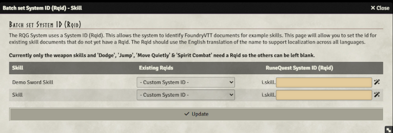
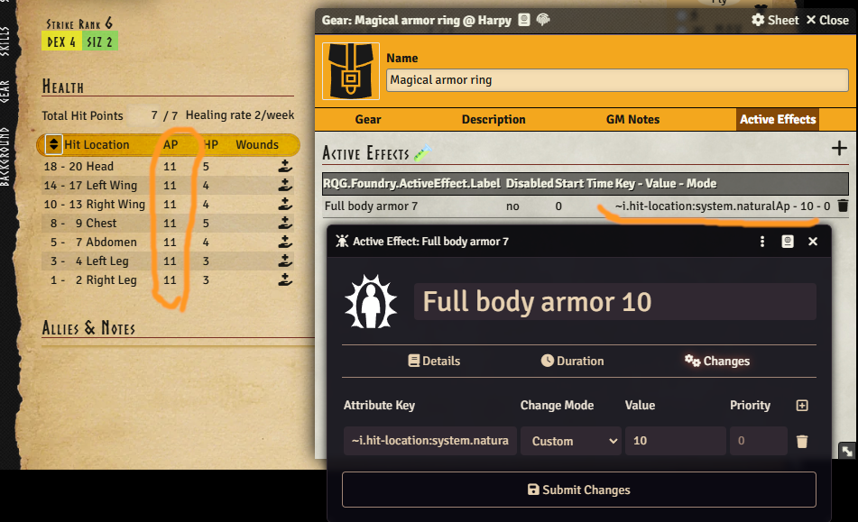
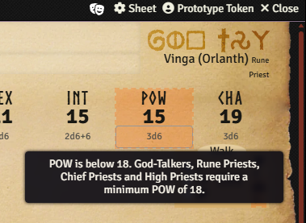
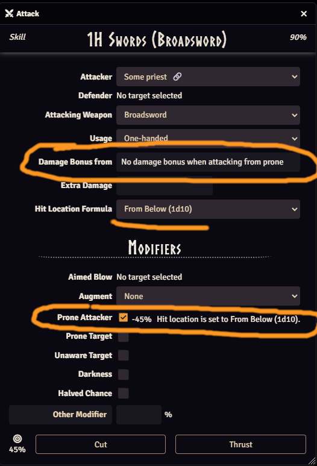
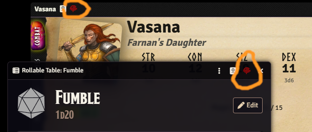
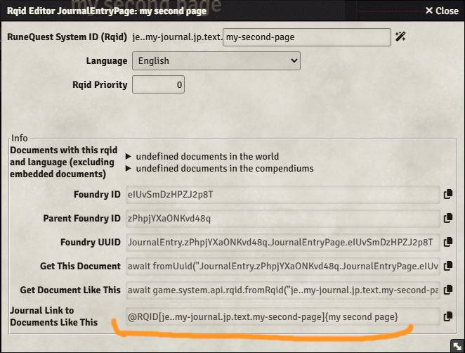
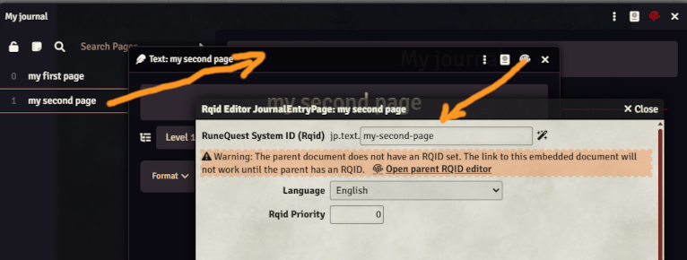

This version fixes a migration issue in version 5.2.0. It also adds a few additional features and
fixes.

## Fix the migration issue from v5.2.0

<GithubIssue issue="834" repo="fvtt-system-rqg" />

In some worlds, you could get a lot of console logs, and the migration could take a very long time
or even time out and stop. This version fixes that problem, and it also reduces the number of
notifications that are shown by combining progress into fewer notifications.

In addition to this, the performance of the editor where you can add RQIDs to documents that are
missing it is improved. It should no longer potentially crash your browser if you have lots of
edits, and it should feel a lot snappier.

## Allow Active Effects to affect multiple items

<GithubIssue issue="571" repo="fvtt-system-rqg" />

It is now possible to create Active Effects that affect multiple items. By prepending the Rqid
string with a ~ the Rqid will behave as a regex and all items that match that regex will be affected
by the Active Effect.

An example of what this could be used for is creating an Active Effect that applies to all hit
location items like this: `~i.hit-location`. That would match any hit location like
`i.hit-location.head` or `i.hit-location.left-wing`. You can also use the normal regex syntax to
build something more complex like `~i.cult.*orlanth.*` to find any cult that contains the word
orlanth.

For people who know how to write regex: yes, the dots in, for example, `~i.hit-location` will be
interpreted as "any one character". But in practice that should not matter. You could write it as
`~i\.hit-location` to be more strict if you wanted to.

## Show warning if POW < 18 for priests

<GithubIssue issue="652" repo="fvtt-system-rqg" />

The POW characteristic now gets a warning if it falls below 18 for cult ranks that require a
character to have at least 18 POW.

## Attacking from prone

<GithubIssue issue="789" repo="fvtt-system-rqg" />

There is now a new checkbox in the attack dialog where you can select that you are attacking from a
prone position. This follows the rulebook by changing the hit location die to 1d10 (From Below) and
removing the damage bonus if you are not attacking with a natural weapon.

## Color the RQID icon red if it's missing

<GithubIssue issue="813" repo="fvtt-system-rqg" />

The sheet header RQID button is now colored red if the document does not have an RQID. This makes it
easier to see at a glance if there is a problem.

## RQID editor now handles embedded documents

<GithubIssue issue="742" repo="fvtt-system-rqg" />

The RQID editor previously did not handle embedded documents like pages in a journal. It now does,
that, making it possible to link to a specific page for example. It could also be used to find other
embedded documents like items in an actor, but I think the main use for this is pages in journals.

With this you could add links directly to pages in another journal using rqid. Copy the link from
the example at bottom of the editor and paste that into any other journal.

It will warn if the parent document does not have an RQID set since the embedded RQID will not work
in that case, see below.

