:::warning

This is a major release that requires Foundry v14. It also changes what documents are picked up by
Rqid prioritization (see below), which can alter existing worlds. Given the scope of the changes,
expect a higher risk of new bugs than usual.

Make sure to back up your world before updating!

:::

This release is a large overhaul of the system internals, with the overarching goal of moving this
now six-year-old system into Foundry v14's way of doing things. The character and item sheets have
been rewritten to use Foundry's V2 document sheets, the data layer has been migrated to use
DataModels, and the world migration now generates a detailed report of what changed.

There are also many smaller improvements — from new fields that Active Effects can target to affect
a weapon's attack chance, to a combat tracker button that resets the active combatant to the first
one. See below for the full list of changes and bug fixes.

## RQID Changes

:::caution

Both of these changes are breaking: they can alter which linked documents are shown in your world
after upgrading, and the RQID API functions used by custom macros/modules are changed — see below.

:::

<GithubIssue issue="838" repo="fvtt-system-rqg" />

### Priority Is Now Compared Globally

Previously, when resolving an RQID (e.g. to link a rune, journal, or spell to its canonical
document), a matching World document was always preferred over a matching Compendium document, no
matter what Priority value each had. From this version, RQID resolution instead picks whichever
matching document has the highest Priority — World or Compendium — and only falls back to preferring
the World document when priorities are tied.

In practice, this means: if you have customized or overridden a system document in your World (for
example, a house-ruled skill or journal description), and the shipped Compendium version of that
document ends up with an equal or higher Priority, the Compendium version may now be used instead of
your World override. To keep your World version taking precedence, open it in the RQID editor and
make sure its Priority is set higher than the Compendium document it's meant to replace.

### Breaking API Changes for Macros and Module Authors

If you have custom macros or modules calling the RQID API directly, two methods changed shape as
part of this update:

- `Rqid.fromRqidRegexAll(regex, docPrefix, lang, scope)` has been renamed to `Rqid.fromRqidRegex`,
  and its `scope` string (`"world"` / `"packs"` / `"all"`) is now an options object:
  `Rqid.fromRqidRegex(regex, docPrefix, lang, { source: "world" | "packs" | "all", mode: "all" | "best" })`.
- `Rqid.fromRqidCount(rqid, lang, scope)`'s `scope` string is likewise now an options object:
  `Rqid.fromRqidCount(rqid, lang, { source: "world" | "packs" | "all" })`.

Existing worlds don't need any changes for this — only custom scripts/macros calling these methods
directly need to be updated.

## Foundry DataModels

<GithubIssue issue="855" repo="fvtt-system-rqg" />
<GithubIssue issue="880" repo="fvtt-system-rqg" />

All system data — including derived values like skill category modifiers and hit point totals — now
uses Foundry's DataModels, a data layer that validates your characters, items, and other documents
against a defined structure. This is also the groundwork behind the new `effect.add` fields
described under Active Effects below.

Updating to this version triggers a one-time check of your existing documents against these new
rules, repairing anything that doesn't match — a chance to heal documents that may have drifted out
of shape over the years. This runs automatically as part of the system migration when you update. If
you want to run this check again later, there's a macro for that in the "System Macros" compendium,
in the "RuneQuest Glorantha System/Macros" folder.

## Structured Migration Reporting

<GithubIssue issue="891" repo="fvtt-system-rqg" />
<GithubIssue issue="902" repo="fvtt-system-rqg" />

When the system migrates your world data, it now provides a detailed migration report showing
exactly what was changed. This includes change diffs and migration metadata so you can review what
happened. The report is saved as a journal entry in your world, with pages listing what was
performed, any issues found, and a summary. If any characters or items could not be fully repaired
by the automatic migration, they are listed so you as the GM can look at them manually.

## V2 Character & Item Sheets

<GithubIssue issue="845" repo="fvtt-system-rqg" />
<GithubIssue issue="852" repo="fvtt-system-rqg" />

### Why the Move to V2

The character and item sheets have been completely rewritten using Foundry's Application V2
framework. Foundry has deprecated the old V1 application framework and will remove it in a future
core version, so this move keeps the system compatible going forward. The V2 sheets are now the
default for all characters and items.

:::info

The old V1 sheets are still available as a fallback (right-click the sheet header to switch), but
they are deprecated and will be removed in an upcoming release.

:::

### Light/Dark Mode & Pop-Out Windows

V2 sheets support Foundry's light and dark modes, and can be popped out into their own window using
Foundry's native pop-out feature — something V1 sheets could not do.

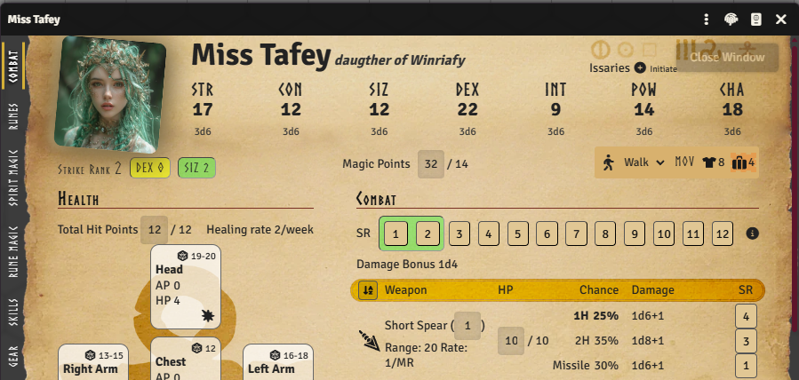 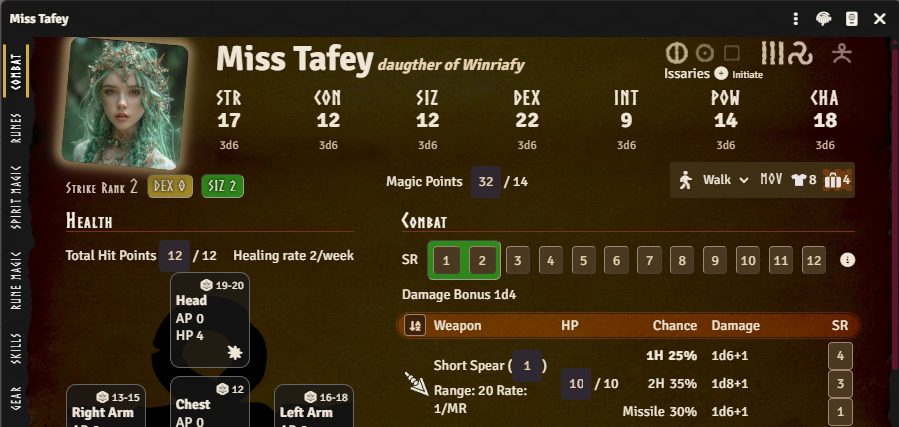

### Drag & Drop Rework

<GithubIssue issue="787" repo="fvtt-system-rqg" />

Drag-and-drop has been reworked. Hovering over a draggable row now reveals a grab icon — grab that
icon to drag the item, rather than clicking anywhere on the row. Dropzones also highlight more
clearly when dragging something over them, making it easier to see where an item will land.

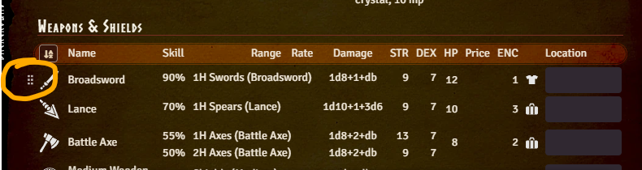

### Item Icon Tooltips

<GithubIssue issue="289" repo="fvtt-system-rqg" />

Hovering over an item's icon on the Gear, Combat, or Passions tab now shows its description in a
tooltip, so you no longer have to open the item sheet just to remember what something does. If you
are the GM and the item has GM notes, those are shown in the same tooltip below the description —
players never see this part.

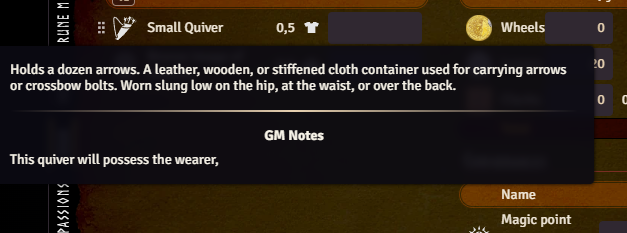

### CHA Rune Magic Point Limit Per Cult

<GithubIssue issue="839" repo="fvtt-system-rqg" />

The character sheet now shows the CHA-based rune magic point limit for each cult, making it easier
to see how many rune points a character can have in each cult.

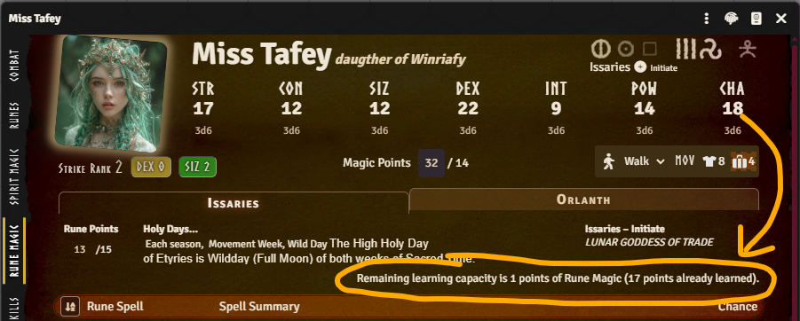

### Skill Search

<GithubIssue issue="193" repo="fvtt-system-rqg" />

The Skills tab now has a search field at the top. Type part of a skill's name to instantly filter
the list down to matching skills, hiding categories that have no matches — handy for characters with
long skill lists. Clearing the field brings back the full list.

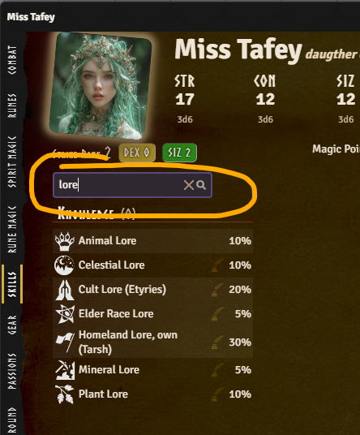

### Rune Display by RQID

The Rune tab has gotten a visual makeover. Each rune icon's size and intensity now reflects how
strong that rune is — the higher the chance, the bigger and bolder the icon. For opposed rune pairs
(e.g. Harmony/Disorder), a balance marker on a line between the two runes shows how far a character
leans towards one side of the pair over the other. Where a rune is positioned depends on its opposed
rune setting.

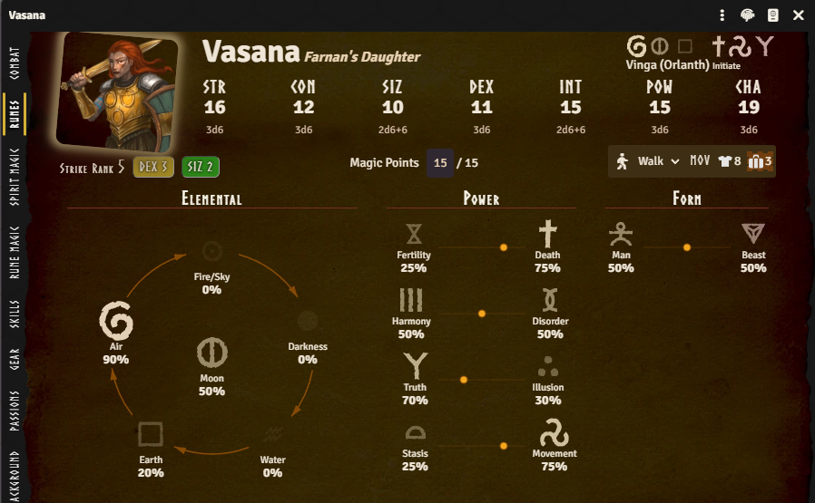

### Apply Wound dialog makeover

<GithubIssue issue="194" repo="fvtt-system-rqg" />

The Apply Wound dialog has had a facelift. The title now names both the character and hit location
(e.g. "Apply Wound to Left Arm of Vasana"), so it's clear who receives the wound when multiple
character sheets are open.

Entering the raw damage dealt shows the armor protecting that hit location (if any) — listing each
equipped piece by name and its AP — plus a formula for the effective damage after AP is subtracted.
If more than one piece of armor covers the location, each piece's AP can be included or excluded
individually — useful, for example, with fall damage, where only soft armor applies — or all at once
via a master checkbox.

A second checkbox and formula show whether (and how) the wound also reduces the character's total
Hit Points, with the before/after total updating as you type. The button that opens the dialog from
each hit location box also traded its old hand-holding-medical icon for a burst symbol.

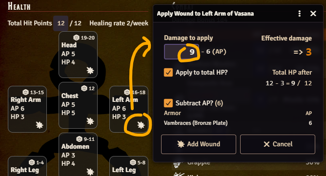

### Heal wound dialog makeover

The Heal Wound dialog got the same treatment. Two buttons at the top — "Heal One Wound" and "Remove
All Damage" — let you either patch up a single wound or clear every wound on the hit location in one
go.

When healing a single wound, "Hit Points to Heal" can be dragged in with a slider or typed directly.
Below that, "Select Wound to Heal" lists each individual wound on the location so you can pick which
one to treat.

The "Heal Wound" button now uses a green heart-pulse icon, and each wound listed under "Select Wound
to Heal" shows a burst icon next to its remaining damage value — the same icon used in the Apply
Wound dialog.

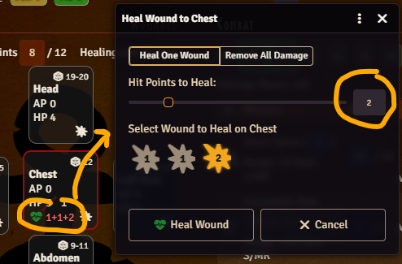

### Spirit Magic Points Editable in Edit Mode

<GithubIssue issue="894" repo="fvtt-system-rqg" />

Variable Spirit Magic spells can now have their invested points edited directly from the character
sheet's Spirit Magic tab. In Edit (green) mode, the points cell becomes a plain number input instead
of requiring you to open the item sheet. Play mode and non-variable spells behave as before.

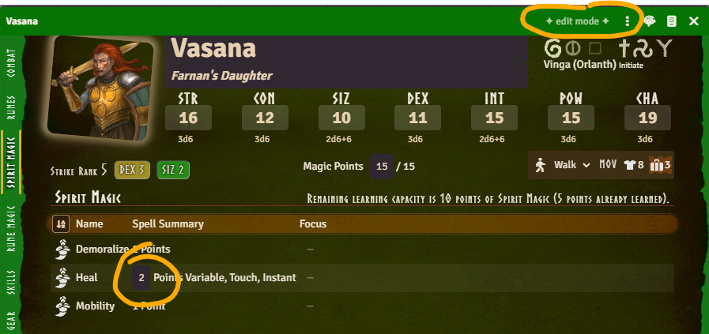

### Compact Spell Summary for Rune & Spirit Magic

<GithubIssue issue="848" repo="fvtt-system-rqg" />

The Rune Magic and Spirit Magic tables no longer show a separate column for each spell attribute.
Instead, each spell now shows a compact summary string (its "signature"), similar to how spells are
written in the rulebooks — e.g. points, range, duration, and concentration — with the full details
available in a tooltip. As part of this change, Ritual Rune Magic spells no longer have their Range
and Duration silently dropped from the summary, since those values can still be relevant for ritual
casting.

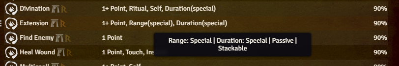

## Active Effects

<GithubIssue issue="919" repo="fvtt-system-rqg" />

The system has been adapted to Foundry v14's new Active Effect format: duration is now a single
value + unit instead of separate seconds/rounds/turns fields, and start time/round/turn/combat are
now grouped under "start".

Your existing effects are converted to this new format automatically when you update, including
moving any legacy MP/HP max bonus paths to the new `effect.add.magicPoints.max` /
`effect.add.hitPoints.max` fields described below.

### New Additive Fields

A new `system.effect.add` namespace exposes additive fields that Active Effects can target in ways
that weren't previously possible. None of these values could be targeted by an Active Effect before,
with one exception: max Magic Points could be boosted directly through a hack in the old version.
The DataModel cleanup removed that hack in favor of its own dedicated field, described below.

#### effect.add.magicPoints.max _(on the character)_

A bonus to max Magic Points — for example from a POW storage crystal. In previous versions, an
Active Effect could target `system.attributes.magicPoints.max` directly and it kind of worked, since
that value was calculated before effects were applied; the DataModel cleanup now calculates it
afterwards, so this dedicated field is needed instead.

#### effect.add.hitPoints.max _(on the character)_

A bonus to max Hit Points.

#### effect.add.skillCategoryModifiers.\<category\> _(on the character)_

A bonus to a skill category — for example, to boost all Manipulation skills with an effect.

:::info

`<category>` is one of: `agility`, `communication`, `knowledge`, `magic`, `manipulation`,
`perception`, `stealth`, `meleeWeapons`, `missileWeapons`, `shields`, `naturalWeapons`,
`otherSkills`.

:::

#### effect.add.melee.attack / effect.add.melee.parry / effect.add.missile.attack / effect.add.missile.parry _(on weapon items)_

Bonuses to a weapon usage's attack and parry chance. As before, effects that target fields on an
item (rather than the character) need to use the "Custom" application mode.

The fields are divided into melee / missile and attack / parry so effects can be limited to, for
example, only melee attacks.

This could be used to create a Bladesharp effect, see below. It's a bit clunky, since you need to
create a separate effect for each weapon and point strength, but it does make it possible to build a
compendium of spell effects that can simply be dragged onto the actor. This handling will be
improved in a future release.

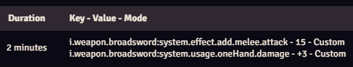

:::note

This whole area of the system is still experimental. More changes to Active Effects — new
`effect.add` fields, other effect modes, etc. — are likely to show up in future releases.

:::

### Match Suspension to Equipped Status

Active Effects on physical items (gear, armor, weapons) now have a "Match Suspension to Equipped
Status" option on the effect itself. When enabled, the effect is automatically suspended/unsuspended
together with the item's equipped state — for example, an Active Effect on a piece of armor can be
set to only apply while the armor is equipped, without needing a separate condition or macro. This
option is off by default; enable it on each effect where you want it, or turn on the world setting
described below to have it on by default for new effects. As soon as you enable the option on an
effect, its suspended state is immediately updated to match the item's current equipped status,
rather than waiting for the next time the item is equipped or unequipped. While the option is
enabled, the effect's "Effect Suspended" checkbox is greyed out and can't be toggled manually, since
its state is now controlled automatically by the item's equipped status.

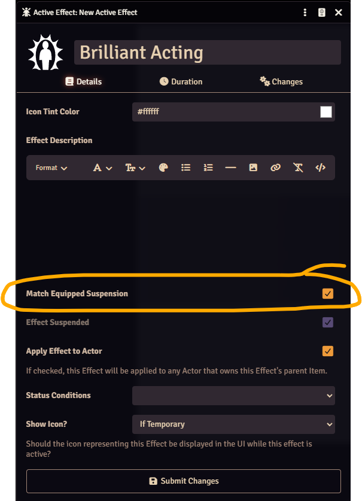

A new world setting, **Default: Match Effect Suspension to Equipped** (off by default), controls
whether newly created Active Effects on physical items have this option enabled by default; existing
Active Effects are left unchanged when you change the setting. Regardless of this world setting, you
can always turn the option on or off for each effect individually.

:::tip

The setting defaults to off for backwards compatibility with existing worlds, but depending on your
preference it's probably a good thing to turn on, so new Active Effects on gear/armor/weapons
automatically suspend when the item is unequipped.

:::

<GithubIssue issue="869" repo="fvtt-system-rqg" />

### Active Effects Tab Setting

The Active Effects tab on the character sheet used to be toggled through a hidden config flag. Now
it is a GM-only world setting "Show Actor Effects Tab", making it much easier to find.

It lists every effect on the character along with Start, Duration and "Match Equipped Suspension"
columns, plus an early-expiry badge whose tooltip flags possible configuration mistakes. As before,
the tab itself is only ever visible to the GM, never to players.

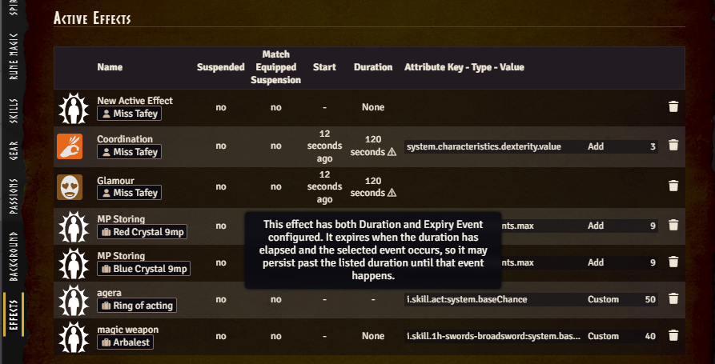

## Weapon Effect Modifiers in Combat

<GithubIssue issue="918" repo="fvtt-system-rqg" />

The Attack and Defence dialogs now show a tooltip breakdown of the target chance, including when a
weapon effect modifier (e.g. from an Active Effect on the weapon) is in play. Hovering the chance
box reveals how the total was calculated.

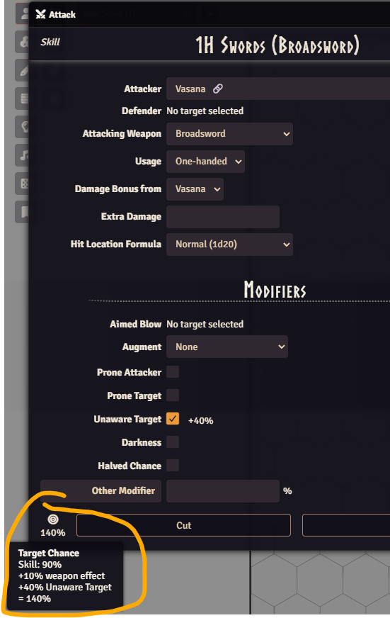

## Combat Tracker Improvements

<GithubIssue issue="899" repo="fvtt-system-rqg" />

There is a new GM-only "Activate First Turn" button on the combat tracker. In RuneQuest, everyone
states which Strike Rank(s) they act on at the start of the round, which can reorder who goes first
— this button lets the GM jump straight to whoever ends up first in the new turn order, instead of
clicking "Previous Turn" repeatedly to get back to the start.

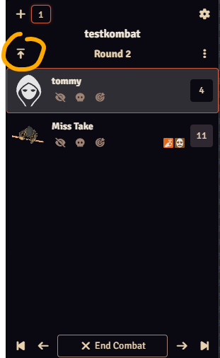

## Protection Token Effects Support All Creature Types

<GithubIssue issue="837" repo="fvtt-system-rqg" />

Protection token effects now use regex RQIDs (introduced in
[RQG 5.3.0](/release-notes/rqg-v5.3.0#allow-active-effects-to-affect-multiple-items)), allowing them
to work with all creature types instead of only humanoid characters.

## Additional Fixes

- Fix deprecated `TableResult#text` in fumble rolls
  (<GithubIssue issue="840" repo="fvtt-system-rqg" />)
- Fix improvement of Runes and Passions not working
  (<GithubIssue issue="856" repo="fvtt-system-rqg" />)
- Fix Rune Magic cult chooser dialog (<GithubIssue issue="864" repo="fvtt-system-rqg" />)
- Fix cult tabs not filling the width (<GithubIssue issue="878" repo="fvtt-system-rqg" />)
- Fix Rune Magic cannot adjust level on stackable spells
  (<GithubIssue issue="831" repo="fvtt-system-rqg" />)
- Fix avoiding mutation of roll modifiers during tooltip render
  (<GithubIssue issue="885" repo="fvtt-system-rqg" />)
- Fix POW crystal Active Effect reads with legacy fallback
  (<GithubIssue issue="875" repo="fvtt-system-rqg" />)
- Fix drag-drop handling and safe skill embedding
  (<GithubIssue issue="698" repo="fvtt-system-rqg" />)
- Remove jQuery usage throughout the codebase (<GithubIssue issue="877" repo="fvtt-system-rqg" />)
- Migrate all deprecated Foundry v14 APIs (<GithubIssue issue="866" repo="fvtt-system-rqg" />)
- Improve cult info column spacing on the v2 Rune Magic tab so the Rune Points and cult/god name
  columns no longer wrap awkwardly, with full text available via tooltip
  (<GithubIssue issue="886" repo="fvtt-system-rqg" />)
- Fix weapon usage rate model error (<GithubIssue issue="858" repo="fvtt-system-rqg" />)
- Show an informational field instead of the damage bonus selector when a weapon usage's damage
  formula has no damage bonus placeholder (<GithubIssue issue="924" repo="fvtt-system-rqg" />)
- Fix detached/popped-out v2 application actions (e.g. the Attack dialog) not working
  (<GithubIssue issue="872" repo="fvtt-system-rqg" />)
- Remove price display from gear items, improve gear tab responsiveness, and improve the
  view-by-location gear view (<GithubIssue issue="248" repo="fvtt-system-rqg" />)
- Derive skill chance at runtime instead of persisting it, avoiding stale values
  (<GithubIssue issue="906" repo="fvtt-system-rqg" />)
- Standardize chat message speaker objects (<GithubIssue issue="909" repo="fvtt-system-rqg" />)
- Localize the RQID header button's aria-label, removing a console warning
  (<GithubIssue issue="933" repo="fvtt-system-rqg" />)
