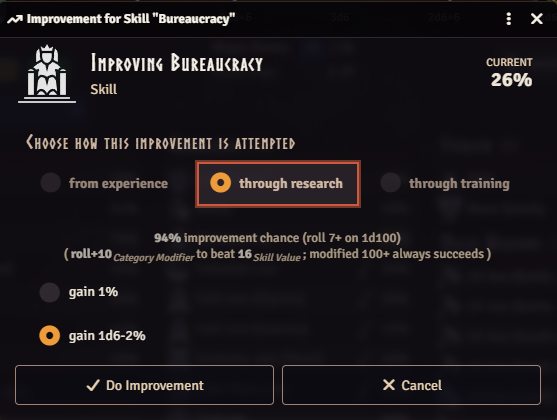
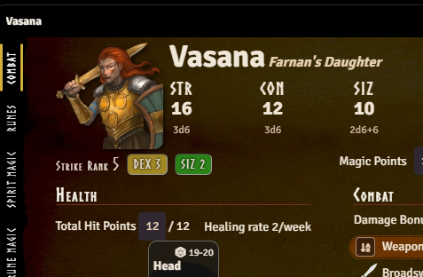

This release follows up on 6.0.0 with a big batch of bug fixes, plus a new Research path for
improving Skills and Runes, as well as a fix so healing a serious abdomen wound now restores the
useless legs it caused.

I was actually worried about more serious bugs after 6.0.0, especially since I'd just migrated to
using Foundry's data models, which are far stricter about what values a document is allowed to have
than the plain objects the system relied on before. Apart from the wiki module's invalid compendium
data (see Invalid Weapon/Spell Data Cleanup below), nothing major has turned up.

I've also been actively hunting for discrepancies against the rules and found a few minor ones: a
wrong special success range for a 6-7% ability chance, and a 75%+ training restriction that blocked
every skill regardless of whether it can gain experience or not. This release also includes several
visual fixes for the v2 sheets.

## Invalid Weapon/Spell Data Cleanup

<GithubIssue issue="986" repo="fvtt-system-rqg" />

Some older wiki module compendium content shipped with two values that don't match the current data
model and get rejected by Foundry's schema validation:

- The **Claw**, **Rip**, and **Gore** natural weapon attacks had an invalid `damageType: "cut"`
  instead of **Slash**, which could show up as "Failed to initialize Item" console errors and make
  the attack unusable.
- The rune spell **Ban** had a malformed `isRitual` value from an authoring typo.

Both trace back to the wiki module's compendium content, present through
**[v1.3.5 (2025-05-25)](/release-notes/wiki-v1.3.5)** and fixed in
**[v2.0.0 (2026-07-18)](/release-notes/wiki-v2.0.0)**. Any item still carrying the invalid value is
now repaired automatically on load, regardless of wiki module version — but updating to v2.0.0 or
later is still recommended, since it fixes the source data too.

:::caution Manual check recommended if you imported this on RQG 6.0.0

This only matters if you imported one of the affected items — the standalone **Claw**, **Rip**, or
**Gore** weapon, a **Brown Bear**, **Harpy**, **Shadowcat**, or **Tusker** (which embed them), or
the **Ban** spell. If that happened from **wiki module v1.3.5 or earlier** while running **RQG
6.0.0**, the invalid value could have been silently replaced with a valid-but-wrong default instead
of causing a crash — e.g. a Claw attack showing "Crush" instead of "Slash", or Ban not marked as
Ritual. That data now looks normal and can't be detected or corrected automatically, so it's worth a
quick check:

- Weapon items → each combat maneuver's **Damage Type** should be **Slash** for Claw/Gore/Rip, not
  **Crush**.
- **Ban** → the **Ritual** checkbox should be on.

If you imported on an earlier or later RQG version, you're not affected — nothing to check.

:::

## Research & Improve Dialog Fixes

<GithubIssue issue="952" repo="fvtt-system-rqg" />

Skills and Runes can now be improved through Research on the Improve Ability dialog, alongside the
existing Experience and Training paths — mirroring the Research option Characteristics already had.
The qualifying roll matches the one used for Experience; on success, the gain is a flat +1% or
1D6-2, chosen before rolling. As with Training, Research is not available for Passions. That it has
been missing until now was an oversight.

A few related bugs in the Improve dialogs were fixed alongside this:

- Base the 75%-and-above restriction on whether the ability can gain experience at all (Core
  p.413), instead of chance alone, and apply the same 75%+ restriction to Research and to Runes,
  both of which previously stayed trainable/researchable at any chance
  <GithubIssue issue="980" repo="fvtt-system-rqg" />
- Block skill training at exactly 75%, not just strictly above it
  <GithubIssue issue="947" repo="fvtt-system-rqg" />
- Require POW training to pass the same POW-gain-roll chance check used for Experience, instead of
  allowing a free roll <GithubIssue issue="948" repo="fvtt-system-rqg" />
- Derive the category modifier from unmodified source characteristics, so a temporary condition
  (e.g. a STR/DEX/CON-bonus status effect) no longer shifts the Experience/Research/Training
  qualifying roll <GithubIssue issue="954" repo="fvtt-system-rqg" />

## Abdomen Wound Healing Restores Useless Legs

<GithubIssue issue="981" repo="fvtt-system-rqg" />

A serious wound to the abdomen (damage at or above the location's max HP) makes the attached legs
useless until it heals. Healing that wound back below the threshold was supposed to restore them,
but the healing logic always reported no legs to restore, so they stayed useless forever even after
the wound had healed. Healing an abdomen wound now correctly restores the legs — to healthy, or to
wounded if a leg had taken damage of its own. A leg that's useless from its own damage rather than
the abdomen wound is left alone.

## Improved Actor Portrait

<GithubIssue issue="969" repo="fvtt-system-rqg" />

The portrait on the v2 character sheet is no longer clipped by the window top, and its drop-shadow
now follows the image's own shape instead of a fixed rectangular box — so round or transparent
portraits no longer get a mismatched square shadow. Non-square images are no longer cropped or
distorted. Right-clicking the portrait now opens Foundry's native image popout for a larger,
on-demand view of the full resolution image.

## Other Styling Fixes

- Give the four standard Power rune pairs fixed tab positions on the v2 sheet regardless of link
  state <GithubIssue issue="970" repo="fvtt-system-rqg" />
- Fix reputation icon rendering as a broken image in worlds whose stored icon settings predate that
  key <GithubIssue issue="976" repo="fvtt-system-rqg" />
- Make table styling consistent across all v2 sheet item-list tabs, including a rebuilt Active
  Effects tab that now shares the same look instead of using its own bespoke table
  <GithubIssue issue="978" repo="fvtt-system-rqg" />
- Prevent a long cult name from squeezing the name column on the v2 actor sheet
  <GithubIssue issue="968" repo="fvtt-system-rqg" />
- Fix rqg SVG icons not matching the invert filter when hosting on the Forge, making them white on
  the light theme <GithubIssue issue="964" repo="fvtt-system-rqg" />
- Fix hit-location and Strike Rank background colors failing to resolve — rendering as transparent
  or dark blocks over light text — when a per-window theme override applies the theme class directly
  to the sheet instead of only to an ancestor like the page body
  <GithubIssue issue="966" repo="fvtt-system-rqg" />

## Migration Fixes

- Fix the Active Effect duration-unit migration re-triggering and reappearing under "Performed
  Migrations" on every migration instead of running once
  <GithubIssue issue="984" repo="fvtt-system-rqg" />
- Fix Active Effect path rewrites (e.g. Add Magic Points/Add Hit Points) being silently discarded
  when the duration-unit migration touched the same effect, and extend the world migration's
  compendium sweep to module-owned packs too, so content in your own modules now gets migrated along
  with the world's <GithubIssue issue="942" repo="fvtt-system-rqg" />
- Fix the migration progress bar duplicating instead of updating when migration runs overlap
  <GithubIssue issue="961" repo="fvtt-system-rqg" />
- Migrate hit-location `connectedTo`/`hitLocationType` data that was stored as a stale display name
  instead of an rqid, which silently broke limb-useless and healing checks with no error
  <GithubIssue issue="983" repo="fvtt-system-rqg" />
- Stop running the migration that re-links opposing runes, so unlinking a pair to exempt an
  Illuminated actor from the opposed-rune 100% rule no longer gets reset on the next update
  <GithubIssue issue="962" repo="fvtt-system-rqg" />

## Other Bug Fixes & Improvements

- Fix MOV and ENC Factor no longer being editable by the GM on the v2 actor sheet header
  <GithubIssue issue="965" repo="fvtt-system-rqg" />
- Localize hit-location damage notifications (limb severed, useless legs, instant death, bleeding
  unconscious, head unconscious) that were previously hardcoded in English
  <GithubIssue issue="988" repo="fvtt-system-rqg" />
- Correct the special success range for a 6-7% ability chance
  <GithubIssue issue="946" repo="fvtt-system-rqg" />
- Hide the health section and use Magic Points instead for actors with no hit points, such as
  spirits <GithubIssue issue="488" repo="fvtt-system-rqg" />
- Limit Spirit Magic learning capacity by CHA instead of INT, and fix Sorcery's Free INT accounting
  and messaging <GithubIssue issue="944" repo="fvtt-system-rqg" />
- Cap Rune Points max by CHA per cult, and default max to 0 instead of null/undefined
  <GithubIssue issue="941" repo="fvtt-system-rqg" />
- Clear a bow's linked projectile when the linked arrow is unequipped
  <GithubIssue issue="655" repo="fvtt-system-rqg" />
