This release's headline feature is a real magic point source picker: casting a spell now lets you
choose where the points come from whenever more than one source is available. POW-storing crystals
work as an alternate source instead of the old max-boosting hack, a Rune Priest's Allied Spirit can
share Magic Points, Rune Points, and spell knowledge with its priest, spirits trapped in an item via
a Binding Enchantment can be drawn on the same way, and a Spell Matrix Enchantment lets a Spirit
Magic spell travel with a physical item for anyone holding it to cast.

Magic Points and natural Hit Point healing also stop being something you have to track by hand: both
now recover automatically as game time passes, computed straight from the world clock instead of a
manual catch-up step.

Alongside that, resolving a season's worth of pending Experience checks no longer means chasing
across the Skills, Rune, and Passion tabs to find every one and opening a separate dialog for each.
A new Experience Roll Session lists everything pending at once with an optional Roll All action. And
a quadruped creature like a horse gets its own hit-location layout on the Combat tab now, instead of
a default table layout.

## Magic Point Storage and Source Picker

<GithubIssue issue="956" repo="fvtt-system-rqg" />
<GithubIssue issue="1023" repo="fvtt-system-rqg" />

Any Gear, Weapon, or Armor item can now act as a POW-storing crystal. Open the item and set a value
greater than 0 in the Stored Magic Points fields: the first represents how many points are currently
stored, the second the maximum it can hold. The "Magic Points Identified?" checkbox is a gate the GM
can use to hide from the players that the item is a POW-storage item.

A storage item only counts as a usable source once it's both equipped and identified - equipped to
match Core's "physical contact" requirement for a Magic Point Enchantment, identified so an
unidentified crystal doesn't announce itself as a battery.

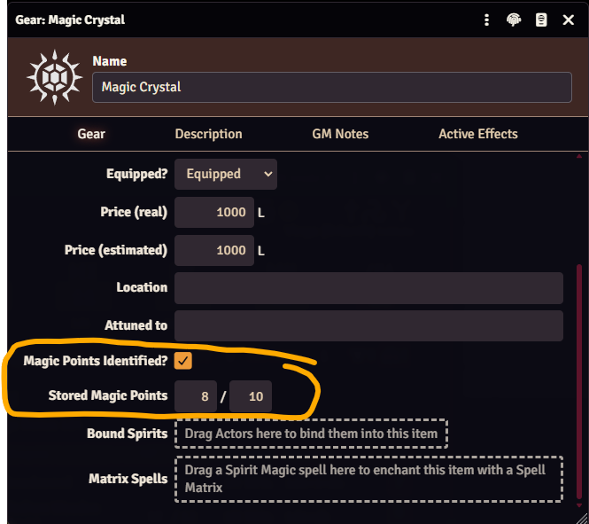

Once a GM sets a max stored points value on the item, it joins the caster's own pool and any Allied
Spirit bond as a possible Magic Point source. Which of those show up as sources at all, and in what
order, is managed from a new Magic Point Source Order popout on the character sheet, with
drag-and-drop reordering - the red numbers show that order. That popout also has a
<LightInvertSvg src="/img/magic-point-feed.svg" width="14" /> button to move Magic Points from the
character (self) into the crystal, moving as many as it can without knocking the character
unconscious.

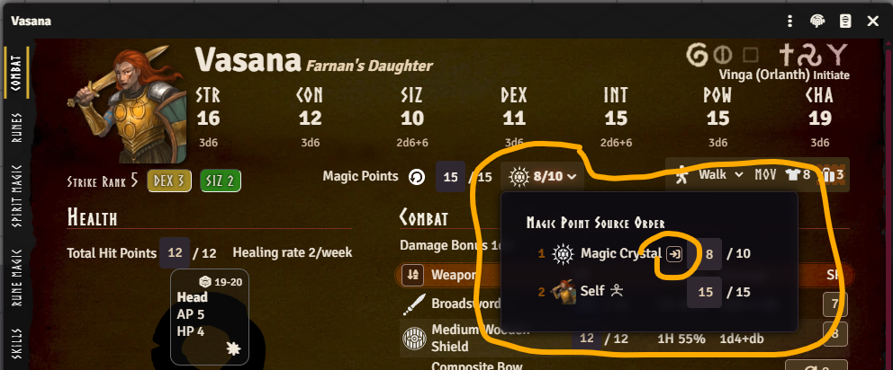

Casting a Spirit Magic spell (or boosting a Rune Magic spell with magic points) now shows a "Magic
Point Source" dropdown. It defaults to "Auto," which drains through the sources in that popout's
order - the caster's own pool is just one entry in that order - but you can also choose to draw from
one specific source for that cast only, if you want. Every option other than "Auto" itself shows its
current/max Magic Points directly, so you can tell at a glance which source actually has anything
left before choosing.

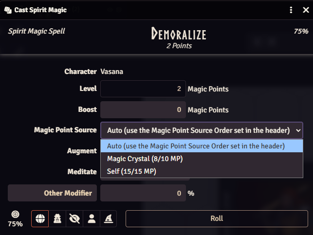

This replaces the old approach of bumping an actor's Magic Point max via an Active Effect on the
item, which merged a crystal's points into the owner's own pool instead of keeping them as a
separate, spendable reserve. Any item still using the old active effect approach is migrated
automatically the next time your world runs its migrations - no manual cleanup needed.

:::caution Manual cleanup needed if you tracked crystal charges via Quantity

If you instead tracked a crystal's remaining points by hand using its Quantity field (e.g. Quantity
5 meaning 5 points left, decrementing it as points were spent), that pattern isn't covered by the
automatic migration - there's nothing in the data for it to recognize. Set the item's new Stored
Magic Points value/max yourself, then set Quantity back to 1 - and consider switching the item's
type to Unique since you no longer need it to behave as a Consumable.

:::

## Allied Spirits

<GithubIssue issue="957" repo="fvtt-system-rqg" />
<GithubIssue issue="1002" repo="fvtt-system-rqg" />

A Rune Priest's Allied Spirit is now more than flavor text. Link the bond partner from the priest's
Combat tab in edit mode by dragging the spirit actor to the Allied Spirit dropzone.

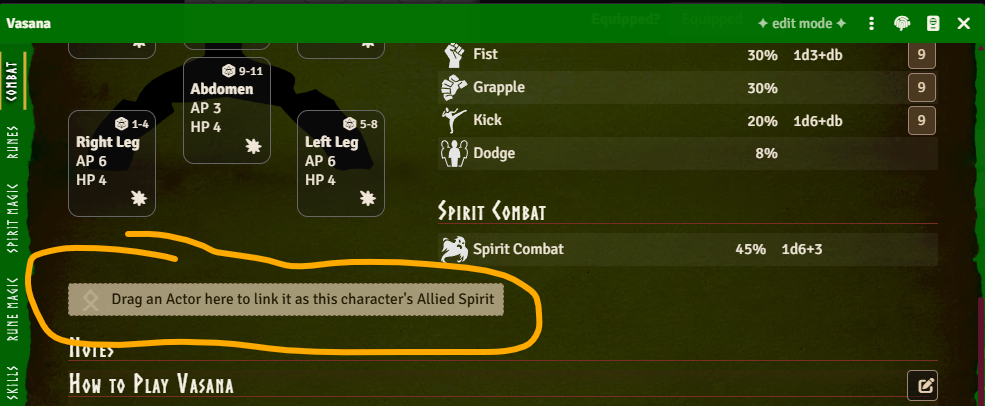

From then on - in either direction - the pair share Magic Points, Rune Points for any cult they're
both initiated to, and known Spirit Magic and Rune Magic spells. That means a priest can cast a
spell their Allied Spirit knows (or vice versa) by drawing on the other's points, even for spells
they never personally learned - shown on the caster's own Spirit/Rune Magic tab under an "Allied
Spirit:" divider so it's clear the knowledge isn't really theirs.

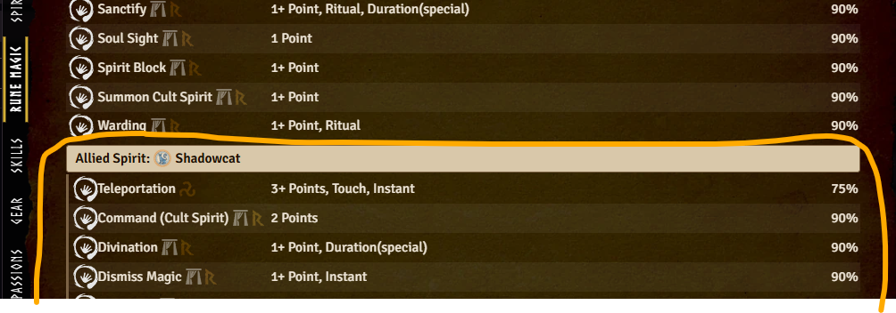

Shared Magic Points also get their own entry in the Magic Point Source Order popout, marked with a
spirit rune so you can tell an Allied (or bound) Spirit apart from a storage item at a glance.

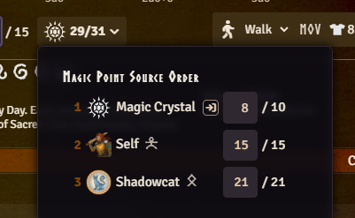

:::info

Rune Point sharing matches the priest's and Allied Spirit's cults by their Rqid - something cults
never needed before this release, so an older cult item in your world may not have one. The Rune
Magic casting dialog now tells you explicitly when a bonded Allied Spirit exists but isn't
recognized as sharing a cult, instead of the source picker just silently not appearing, and the Add
Rqids dialog that pops up during migrations now includes cults that lack Rqids, so it can fix this
for you.

<GithubIssue issue="1004" repo="fvtt-system-rqg" />

:::

## Bound Spirits

<GithubIssue issue="999" repo="fvtt-system-rqg" />

A spirit trapped in an item via a Binding Enchantment can now be linked from that
item's sheet by dragging the spirit's actor onto it. It is possible to bind multiple spirits into
one item, letting a single Foundry item represent something like a handful of bound crystals.

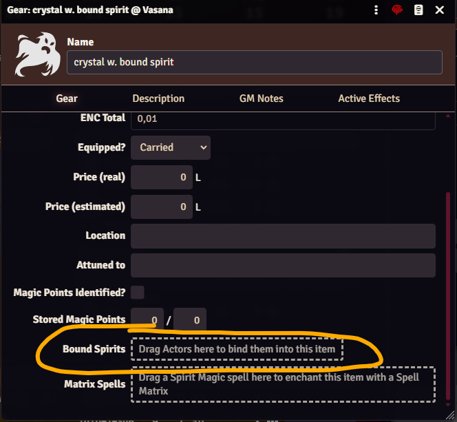

Once bound, whoever holds the item - in other words, has it equipped - can cast any Spirit Magic
spell the spirit itself knows, shown under its own "Bound Spirit:" divider.

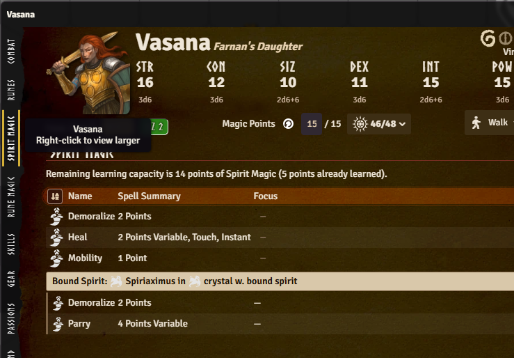

Casting can also draw on the bound spirit's own Magic Points, which get their own entry in the
Magic Point Source Order popout.

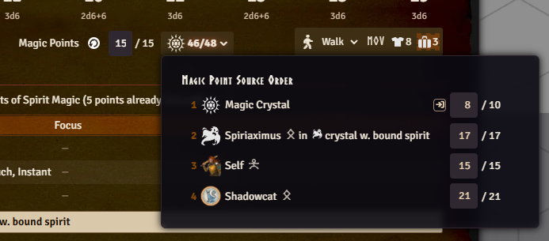

Draining a bound spirit's Magic Points to zero releases it from the binding, and a cast that would
do that prompts for confirmation first. The cap of CHA / 3 total bound spirits is shown as an
informational count on the Combat tab, with a warning if you go over it - since too many bound
spirits should provoke a spirit rebellion.

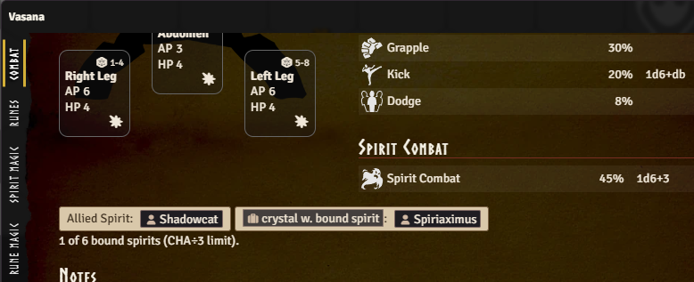

## Spell Matrix Enchantments

<GithubIssue issue="959" repo="fvtt-system-rqg" />
<GithubIssue issue="1021" repo="fvtt-system-rqg" />

Any Gear, Weapon, or Armor item can now carry a Spell Matrix Enchantment: drag a Spirit Magic spell
onto the item's sheet to enchant it, and from then on whoever has that item equipped can cast that
spell, whether or not they personally know it.

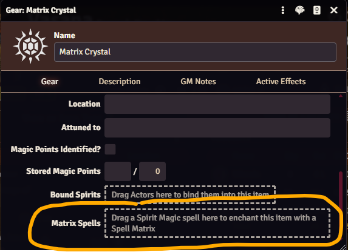

Casting it works straight from the actor sheet on its own entry on the Spirit Magic tab under a
"Matrix:" divider, alongside any existing "Allied Spirit:" and "Bound Spirit:" dividers.

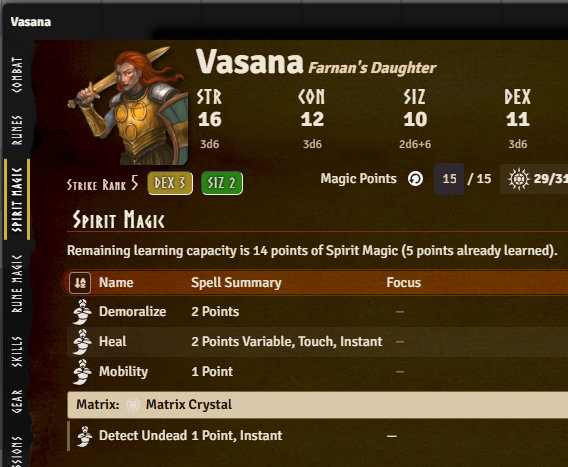

It uses the caster's own POW×5 chance and their own Magic Points, drawn through the same source
picker as any other spell. A matrix spell doesn't count against the holder's own CHA spell-point
limit, since it was never one of their personally-learned spells.

An item isn't limited to one enchanted spell either: drop additional Spirit Magic spells onto the
same item and each gets its own chip on the item sheet, with its own GM-only points field and its
own delete button (points are only editable when the underlying spell is variable - a fixed-level
spell shows its points read-only). In practice that means you could, for example, have several
matrix-enchanted spells embedded in a single sword.

:::caution The old "Held in Matrix" checkbox on a personal spell is now deprecated

Before this release, the closest thing to a matrix was the "Held in Matrix" checkbox on a
character's own Spirit Magic spell (`isMatrix`) - it only ever excluded that spell from the caster's
own CHA spell-point limit, with no connection to a gear item. GMs ended up overloading that one
checkbox for two different situations: a real physical matrix, or a bound/allied spirit's spell
copied onto the character just so it wouldn't count against their CHA limit. This release's Allied
Spirit and Bound Spirit spell-sharing now handles the second case properly, so the checkbox is
superseded - it still exists and still works exactly as before, but should be treated as deprecated.

There's no fully automatic migration for it, and there can't reasonably be one: nothing in the data
says which of the two situations above an `isMatrix` spell represents, and for the real-matrix case,
nothing says which physical item (if any) it was meant to live in - both are always a GM call.

To make it easier to find and convert them, a "Migrate isMatrix Spells" macro in the "System
Macros" compendium (folder "RuneQuest Glorantha System/Macros") lists every `isMatrix` spell in the
world, with the actor and spell as clickable links and the spell's Focus text shown - many GMs use
that field to note which item a matrix should live in. Each row lets you handle that spell at your
own pace:

- **Create Gear** - creates a new Gear item on the same actor with the Spell Matrix Enchantment
  already linked at the same points, and opens it for you to rename.
- **Delete Spirit Magic** (with a confirmation prompt) - removes the now-obsolete original Spirit
  Magic item, once you're happy with its replacement or once you've set up the bonded spirit's
  proper spell-sharing instead.

Neither action fires until you choose it, and a row you resolve just stops showing up the next time
the macro runs.

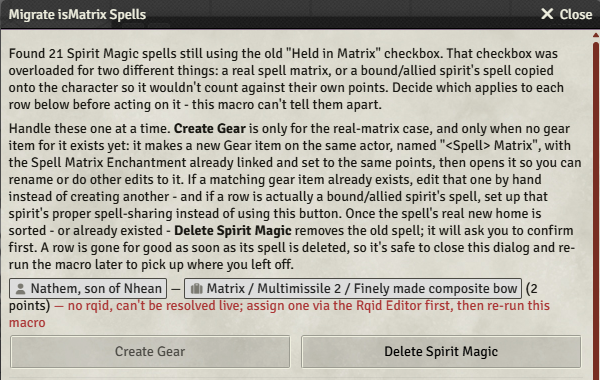

:::

:::info Not an embedded copy of the spell

Enchanting a matrix only stores a link to the spell (a Rqid) plus the number of points enchanted
into it - the spell's own mechanics are never embedded on the item or copied onto it. Every time the
matrix is cast, the system resolves that Rqid fresh against whatever world or compendium item
currently matches it, so a later correction to the spell (or an update to the compendium it came
from) is picked up automatically instead of the matrix carrying a stale copy. It's a new way for an
item to grant a spell in this system - the same Rqid lookup that already backs cross-references
elsewhere, applied here to resolve a spell's mechanics live rather than storing them.

:::

## Magic Point Recovery

<GithubIssue issue="512" repo="fvtt-system-rqg" />
<GithubIssue issue="1028" repo="fvtt-system-rqg" />
<GithubIssue issue="1035" repo="fvtt-system-rqg" />

Magic Points now recover on their own as game time passes, computed straight from Foundry's world
clock. Advancing that clock is a calendar module's job (e.g. Calendaria, GG Calendar, or Seasons &
Stars) - Foundry itself has no built-in way to move it forward, so without one there's no game time
for this to catch up against. Simply opening a character's sheet is enough to catch it up, and so is
the world clock advancing while the sheet is already open.

A new recovery-rate indicator next to Magic Points on the character header shows the resulting
points/day and time-per-point on hover.

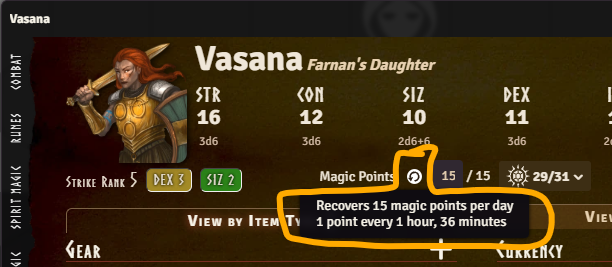

A gift or HeroQuest effect that speeds up or slows down recovery can target the new
`system.attributes.magicPointRecoveryRateFactor` field directly with an Active Effect - e.g., a
Humakti gift doubling recovery speed could `OVERRIDE` this to 2, in effect halving the time it takes
to recover a Magic Point.

For GMs who'd rather not have any silent auto-recovery at all, a new **Automatic Magic Point
Recovery** world setting turns this off entirely, so Magic Point recovery goes back to being applied
by hand. The default for this setting is on, so you need to opt out if you don't want this.

## Natural Healing

<GithubIssue issue="436" repo="fvtt-system-rqg" />
<GithubIssue issue="1031" repo="fvtt-system-rqg" />
<GithubIssue issue="1035" repo="fvtt-system-rqg" />

Natural Hit Point healing now works the same way as Magic Point recovery: it's computed from elapsed
game time instead of anything applied by hand. Each wounded hit location recovers its own healing
rate in points, applied as a lump at the end of each elapsed game week rather than prorated,
matching the Core rule. A location with more than one wound splits the recovered points evenly
across them, with any remainder going to the lightest wound, and a severed or useless location's hit
points still recover naturally even though regaining the use of the limb still takes magic capable
of regrowing it.

This only applies to **player-owned characters** - NPCs are unaffected and still need their healing
applied by hand, same as before. Whether a character was actually resting - which Core requires for
natural healing to apply - isn't tracked or enforced either: healing is applied automatically each
elapsed game week regardless. There's no per-character override for this; the only control is the
**Automatic Natural Healing** world setting, which turns automatic healing off entirely for GMs
who'd rather enforce that condition by hand instead. The default is on, so you need to opt out if
you don't want this.

## Experience Roll Session

<GithubIssue issue="912" repo="fvtt-system-rqg" />

A new menu item on the actor sheet header opens a single-screen session listing every pending
Experience check on the character at once - skills, Runes, Passions, and POW - with an optional Roll
All action and a fixed/random gain toggle, instead of working through each one's own Improve dialog
in turn.

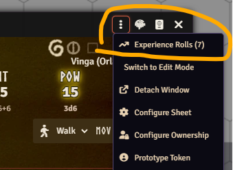

Each row in the session shows what you need to know to make the call before rolling:

- The **Fixed | Random** selector (top left) chooses whether a successful improvement gains a fixed
  amount or a random one - what that amount actually is differs by improvement type, and is shown
  on each row (see the `+1d3-1` vs `+1d6%` in the screenshot below).
- The pill next to each item shows the target you need to roll to improve: **under** a value for
  Runes, **over** a value for everything else. Hovering it shows a tooltip explaining how that value
  was calculated.

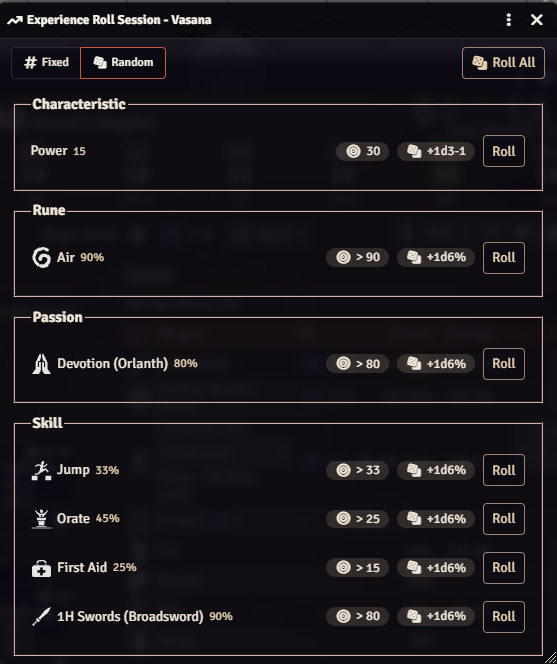

Rolling through the per-item improvements leaves a summary of how each improvement attempt went, so
at the end you will have an overview of how lucky you were. Rolling also generates chat messages for
the improvement rolls, and if you do a "Roll All" you get a combined chat message for all the rolls
at once.

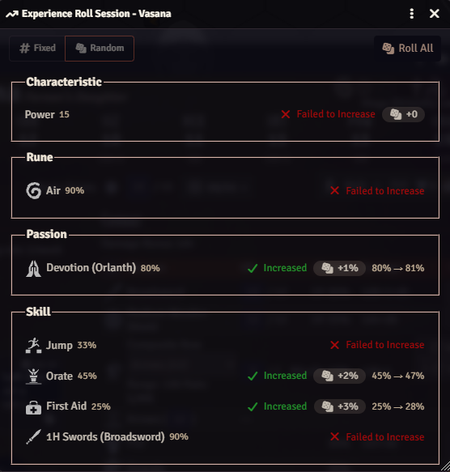

## Quadruped Hit-Location Visualization

<GithubIssue issue="1033" repo="fvtt-system-rqg" />

The hit-location visualization on the Combat tab - previously laid out for humanoid actors only -
now recognizes quadruped creatures too, based on their hit locations, and shows them against their
own silhouette (head, forequarters, hindquarters, legs) instead of a default table layout.

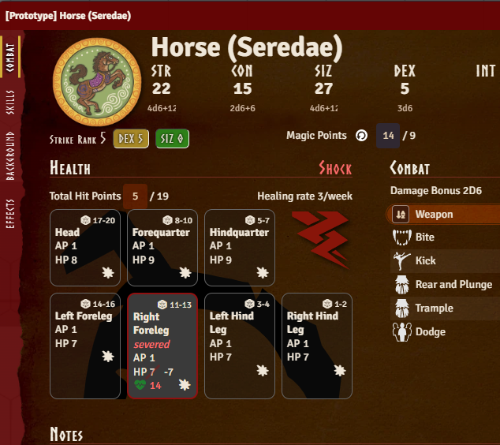

## Other Bug Fixes

- Fix Active Effect duration units reading the wrong (deprecated) property and localizing to a key
  that doesn't exist in Foundry v14, which logged a warning on every render
  <GithubIssue issue="992" repo="fvtt-system-rqg" />
  <GithubIssue issue="993" repo="fvtt-system-rqg" />
- Stop shipping a duplicate manifest in the release package, which broke the Forge's package caching
  <GithubIssue issue="1000" repo="fvtt-system-rqg" />
- Allow a natural or hit-location-linked weapon (fist, bite, claw, etc.) to leave its own Hit Points
  unset instead of forcing them to 0, since it uses the owning hit location's HP instead
  <GithubIssue issue="1012" repo="fvtt-system-rqg" />
- Fix the Spirit Magic tab's points input rendering far wider than intended in edit mode, throwing
  off row alignment
  <GithubIssue issue="1016" repo="fvtt-system-rqg" />
- Fix the actor sheet's drag-and-drop highlight getting stuck on, instead of clearing, when a drag
  moves onto an overlapping Item Sheet
  <GithubIssue issue="1025" repo="fvtt-system-rqg" />
