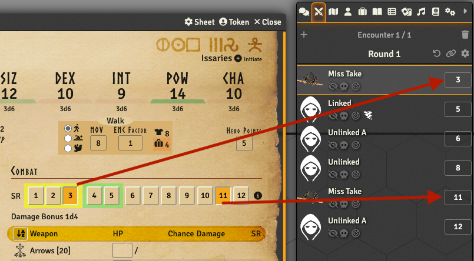
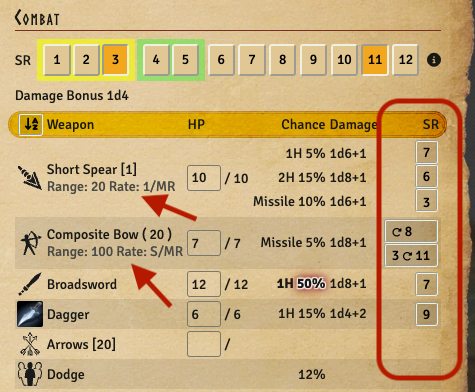
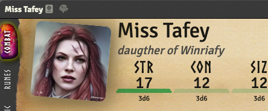

:::warning
This release requires a separate wiki module to be installed and activated. Please look at the [Installing](/docs/getting-started/installing) page for details.
:::

## Move system compendiums into a separate wiki module [Issue #597](https://github.com/sun-dragon-cult/fvtt-system-rqg/issues/597) & [Issue #598](https://github.com/sun-dragon-cult/fvtt-system-rqg/issues/598)
Having the compendiums as a separate module, one per language, mean a lot less compendiums in the system in the future when
we have multiple languages. It also simplifies the administration of what set of wiki you want since it will be handled by
activating / deactivating modules instead of specialised settings in the system. Having them as a separate module also simplifies
releasing updates since the module can be released independently of the system.

The previous compendium packs were built for the previous Foundry database NeDB, but the new wiki module builds database files
for the v11+ database "classic level" so Foundry does not need to convert them at startup anymore.

## Add SR buttons to actor sheet [Issue #620](https://github.com/sun-dragon-cult/fvtt-system-rqg/issues/620)
For linked actors that currently are in combat there is now a row of 12 SR buttons. Clicking one of those will add a combatant
to the current combat tracker at that SR, and clicking it again will remove it. There is also a ⓘ icon with a tooltip that has a
reminder about how many SR various actions take. The DEX SR and SIZ SR are visualised by background color as an aid when using this.

## Reset Initiative removes duplicate combatants [Issue #509](https://github.com/sun-dragon-cult/fvtt-system-rqg/issues/509)
The top of the combat tracker is updated so that the "Reset Initiative" ↺ button clears all duplicate combatants and their SRs.
The previous buttons "Roll All" & "Roll NPCs" are removed since they make no sense for RQG.

## Missile weapon SR buttons [Issue #510](https://github.com/sun-dragon-cult/fvtt-system-rqg/issues/510) & [Issue #504](https://github.com/sun-dragon-cult/fvtt-system-rqg/issues/504)
Missile weapons now have buttons for populating the combat tracker at the SRs they can shoot. For weapons with rate S/MR 
there are two buttons depending on if you start the round with a loaded arrow or not. The Range and Rate of missile weapons 
are now shown, both on the combat tab and on the gear tab.

## Actor name extendedName field [Issue #549](https://github.com/sun-dragon-cult/fvtt-system-rqg/issues/549)
The actor name is now divided into the name field and an extendedName / epithet field. The intended use is to keep the 
name short since that is what is displayed in sidebars, chat etc. The epithet field could then be used for family names 
or descriptive addons like "son of Herila" or "the dragon slayer". As part of this change the layout of the header was 
also updated, and if the actorsheet width is reduced the image is hidden to conserve space.

## Integration with module Drag Ruler [Issue #618](https://github.com/sun-dragon-cult/fvtt-system-rqg/issues/618)
If you have the module [Drag Ruler](https://foundryvtt.com/packages/drag-ruler) active then you will get feedback on
how far you can move your token. By default the green color means you are within attack range, a yellow color means
you can get there but cannot attack. Red color means you cannot get there.

There is also support for an optional rule that lets you sprint further than your MOV. See "Speed Provider" settings
in the drag ruler module settings.

## Smaller bug fixes, features and refactorings
- Actors now fall unconscious when they reach zero magic points [Issue #414](https://github.com/sun-dragon-cult/fvtt-system-rqg/issues/414)

- CON 0 gives wrong Max ENC [Issue #610](https://github.com/sun-dragon-cult/fvtt-system-rqg/issues/610)

- Improve restart settings code [Issue #616](https://github.com/sun-dragon-cult/fvtt-system-rqg/issues/616)

- Improve Active Effect tab [by showing a link to the item an AE originates from [Issue #617](https://github.com/sun-dragon-cult/fvtt-system-rqg/issues/617)

- add translations for sheet names (items, actor & rollTable)

- fix error message for non integer ENC Factor values

- make default item icon colors black in the settings dialog
