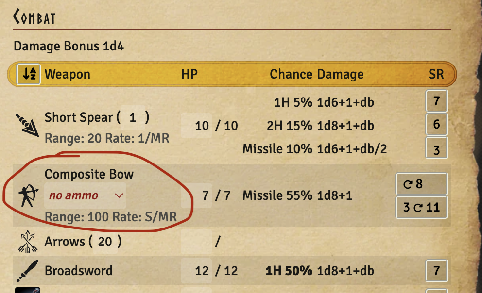
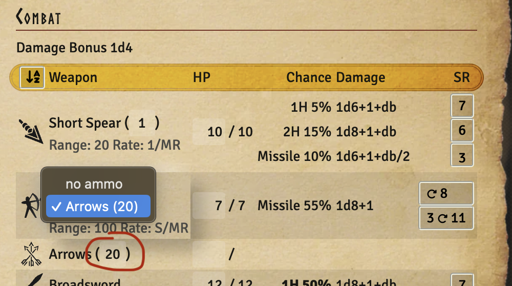
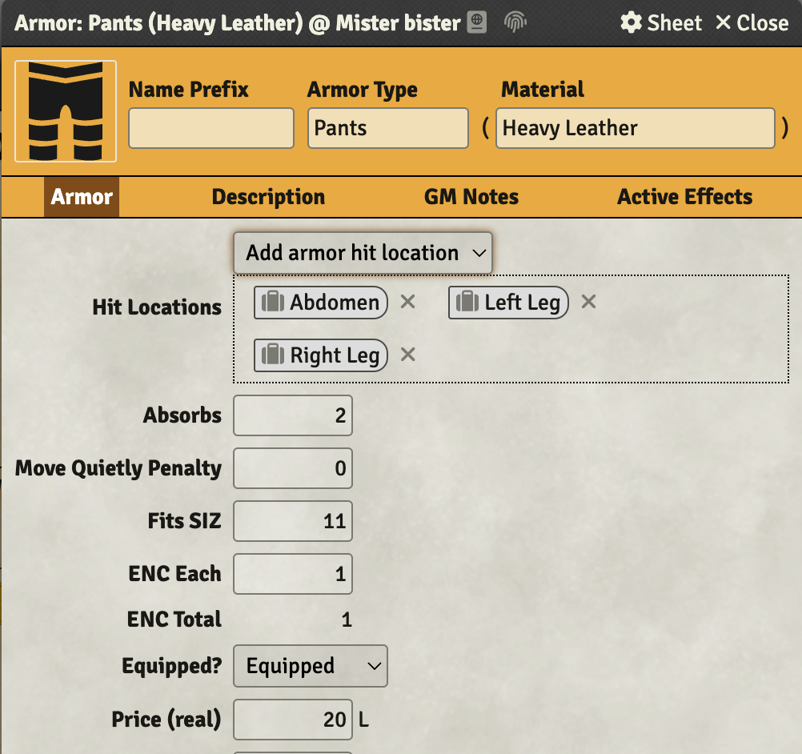
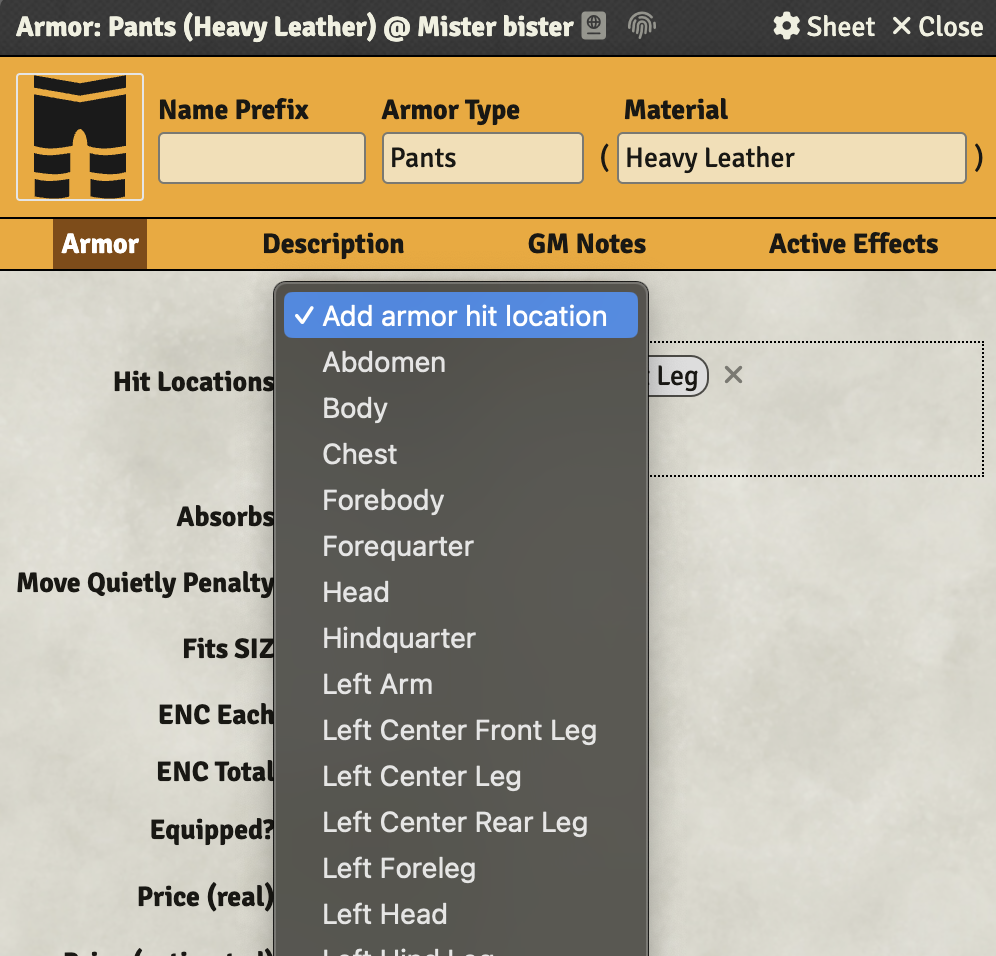
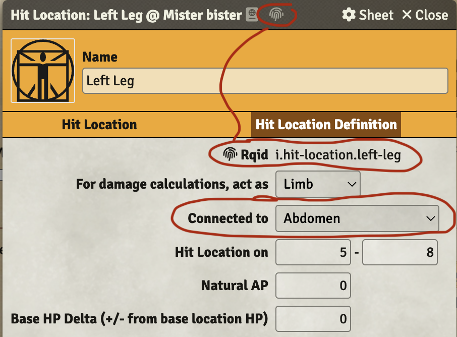

:::warning

Make sure to update the wiki module to at least version 1.2.0 since this system version includes
changes to document types that needs to be reflected in these documents. Please look at the
[Installing](/rqg-system/getting-started) page for details about the wiki module.

:::

A focus of this release has been to remove the last hindrances to translate the system. Now hit
location names are no longer used for identification so they can be translated without affecting
functionality. There is most likely still rough edges when it comes to translations, but from this
version everything should be translatable.

## Improve UX of missile weapons & projectiles – [Issue #154](https://github.com/sun-dragon-cult/fvtt-system-rqg/issues/154) & [Issue #492](https://github.com/sun-dragon-cult/fvtt-system-rqg/issues/492)

In previous versions only the GM could select what arrows a bow should use. With this update the
players can do that themselves in the combat tab on the actor sheet. The quantity of projectiles and
thrown weapons can now be edited directly in the combat tab as well. The input fields have a
slightly brighter color than the rest of the sheet. And hopefully it should be easier to understand
how much ammo you have. Please note that only equipped ammo will be shown in the dropdown.
 

## Use rqid for armor coverage and remove hit locations setting – [Issue #379](https://github.com/sun-dragon-cult/fvtt-system-rqg/issues/379) & [Issue #380](https://github.com/sun-dragon-cult/fvtt-system-rqg/issues/380)

The hitlocations were previously identified by name, and the available hitlocations were defined in
a setting. That setting is now removed and the compendiums in the world are now scanned by the
system for hit location rqids. This is part of making hit locations translatable, but it also makes
it more important that the hit locations actually have a proper rqid, since that is used to identify
what an armor item protects.

You can either drag and drop a hit location item to the "Hit locations" area on the armor item or
select one in the dropdown to add it to the set of hit locations the armor item protects.
 

## Change the hit location "Connected to" field to use rqid instead – [Issue #449](https://github.com/sun-dragon-cult/fvtt-system-rqg/issues/449)

To completely remove any use of hit location names for identification, the "Connected to" property
now also uses rqid. A hit location item "Connected to" setting is used in damage calculations. Hit
locations that have a "for damage calculations act as" set to "Limb" and also are "Connected to" a
hit location that have "for damage calculations act as" set to "Abdomen" will become useless if the
Abdomen hit location gets a hard blow.

Also since the rqid now is so important for hit location items it is shown among the other
properties (see screenshot). If you need to edit it, the normal fingerprint icon in the header will
open the rqid editor.

The "Connected to" dropdown is populated by the hit locations in compendiums that have a hit
location rqid.

## Bug Fixes & Improvements

- add headbutt & hit as combat maneuvers
- spirit Combat panel should not be visible without spirit combat skill –
  [Issue #658](https://github.com/sun-dragon-cult/fvtt-system-rqg/issues/658)
